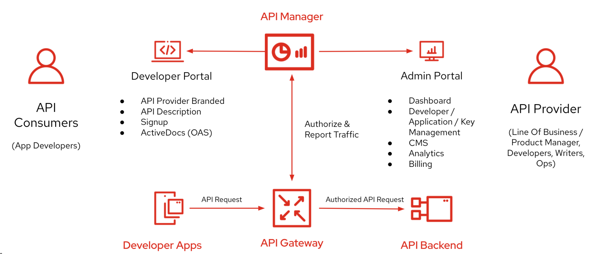
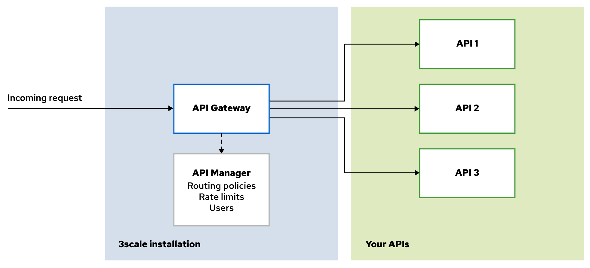
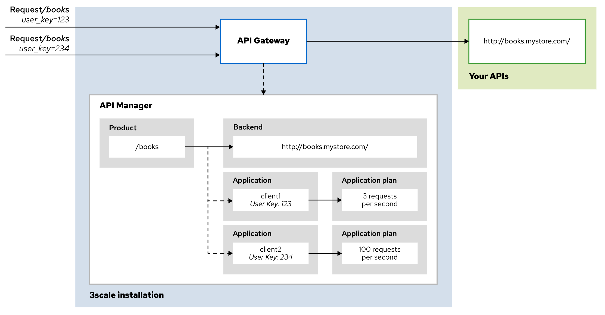
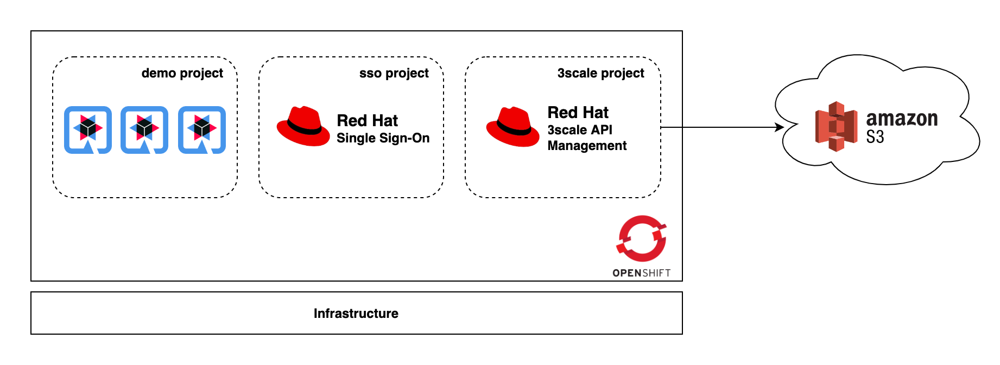

# [Red Hat 3scale API Management](https://www.redhat.com/en/technologies/jboss-middleware/3scale) on OpenShift Demo

Red Hat 3scale API Management on OpenShift Container Platform demonstration preparation and guide.

## Table of Contents

- [Installation Guide](/documents/installation.md)
- [3scale Architecture](#3scale-architecture)
  - [3scale high level overview](#3scale-high-level-overview)
  - [3scale basic architecture](#3scale-basic-architecture)
  - [3scale basic resources](#3scale-basic-resources)
- [Demo Cluster Overview](#demo-cluster-overview)
- [Demo Applications](#demo-applications)
- [Testing Demo Applications](#testing-demo-applications)
- [Working With 3Scale API Management (Demo)](#working-with-3scale-api-management-demo)
- [References](#references)

## 3scale Architecture

### 3scale high level overview

### 3scale basic architecture

### 3scale basic resources

- **Backend** - represents a deployed backend application or service by pointing to its root URL.

- **Product** - previously called services, represent a collection of 3scale objects that pertain to a specific client or group of users. Products contain the following 3scale configuration objects:

  - **Application plans** - sets of access rights that allow users to define different rules for consumers of managed APIs. You can use application plans to set rate limits, enable features, resources, and methods for API users.

  - **Applications** - represent a client application who is consuming API(s) via API gateway.

  - A map of backends to applications

  Note that backends do not belong to a product. This is because the same backend can be associated with several different products. Different products do not need separate backends for the same underlying API.

## Demo Cluster Overview

Once you've done all [installation steps](/documents/installation.md) above, the overview of OpenShift cluster will be like this.

## Demo Applications

The applictions used for demo are forked from projects created by the clever people out there. All credits are given to the project owners.

- [Sample Quarkus Microservices](https://github.com/audomsak/sample-quarkus-microservices)

- [Sample SOAP Spring Boot microservice](https://github.com/audomsak/ws-employee-soapcxf)

## Testing Demo Applications

Follow this [guide](documents/testing-application.md) for how to test the demo applications.

## Working With 3Scale API Management (Demo)

1. [Onboarding new API consumer](documents/onboarding-new-api-consumer.md)
2. [Expose legacy (SOAP) API to outside world](documents/expose-soap-api.md)
3. [More secure and flexible with API Key-pair](documents/secure-with-api-key-pair.md)
4. [Limit API calls using Rate Limit](documents/rate-limit.md)
5. [Secure your API with OpenID Connect OAuth 2.0 standard](documents/oauth-secure.md)
6. [Running Self-Managed API Gateway on OpenShift](documents/self-managed-gateway.md)
7. [Running Self-Manage API Gateway on VM](documents/self-managed-gateway-vm.md)
8. Access Control based on IP Address

## TODO

- Multi-Environments management guideline
- API as Code, CI/CD pipeline (Tekton + ArgoCD)
- 3scale setup using NFS server running in the same cluster

## References

- DO240 - Cloud-native API Administration with Red Hat 3scale API Management course. ([Public](https://www.redhat.com/en/services/training/do240-cloud-native-api-admin-red-hat-3scale-api-management), [RedHatter](https://role.rhu.redhat.com/rol-rhu/app/catalog?q=3scale))
