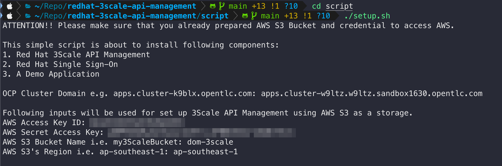
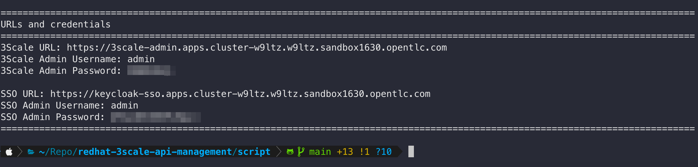

# Red Hat 3Scale API Management on OpenShift Demo

Red Hat 3Scale API Management on OpenShift Container Platform demonstration preparation and guide.

## Requirements

- Red Hat OpenShift Container Platform 4.10
- AWS Web Services account ([Create AWS Free Tier account](https://aws.amazon.com/free))
- [Postman](https://www.postman.com/downloads/)
- OpenShift CLI (oc)
- [OpenSSL](https://www.openssl.org/source/) binary (should already exists on Mac and Linux)

## Installation Steps

1. [Setup AWS S3 bucket and create access key](documents/aws-s3-setup.md)

2. Open a terminal and login to OpenShift cluster with cluster admin privilege user i.e. `opentlc-mgr` (if you provisioned the cluster from RHPDS).

3. Clone this repository to your computer. Change directory to the [script](/script/) directory then run the [setup.sh](script/setup.sh) script to install 3Scale and SSO operators, 3Scale API Manager instance, and SSO (Keycloak) instance.

   The script will ask for OpenShift cluster domain, AWS credential, and AWS S3 bucket information. Enter your cluster domain and AWS input like a screenshot below.

   

4. **The installation process will take for a while to get completed**. At the end, the script will show you 3Scale and SSO web console URLs as well as credentials for login.

   

## 3Scale Architecture

### 3Scale high level overview

### 3Scale basic architecture

### 3Scale basic resources

- **Backend** - represents a deployed backend application or service by pointing to its root URL.

- **Product** - previously called services, represent a collection of 3scale objects that pertain to a specific client or group of users. Products contain the following 3scale configuration objects:

  - **Application plans** - sets of access rights that allow users to define different rules for consumers of managed APIs. You can use application plans to set rate limits, enable features, resources, and methods for API users.

  - **Applications** - represent a client application who is consuming API(s) via API gateway.

  - A map of backends to applications

  Note that backends do not belong to a product. This is because the same backend can be associated with several different products. Different products do not need separate backends for the same underlying API.

## Demo applications

The applictions used for demo are forked from projects created by the clever people out there. All credits are given to the project owners.

- [Sample Quarkus Microservices](https://github.com/audomsak/sample-quarkus-microservices)

- [Sample SOAP Spring Boot microservice](https://github.com/audomsak/ws-employee-soapcxf)

## Demo cluster

## Working with 3Scale API Management

1. Expose REST API via API Gateway
2. Expose SOAP API via API Gateway
3. Limit API call with Rate Limit feature
4. Secure API with API Key and API Key-pair
5. Secure API with OAuth2 using Red Hat SSO
