# Access Control based on IP Address <!-- omit in toc -->

## Steps <!-- omit in toc -->

- [1. Get IP Address](#1-get-ip-address)
- [2. Add Policy to API Product](#2-add-policy-to-api-product)
- [3. Testing](#3-testing)

## 1. Get IP Address

Go to [ifconfig.me](https://ifconfig.me/) to check your IP Address.

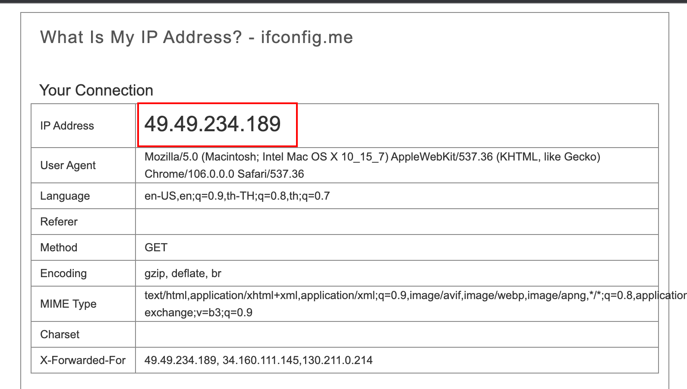

Note. You can also use `curl https://ifconfig.me` command to get you host IP address.

## 2. Add Policy to API Product

1. Switch to 3scale admin web console, click **API** link in the **Products** panel from the main dashboard.

   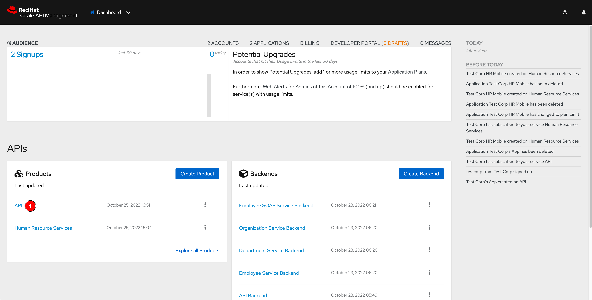

2. Select **Integration -> Policies** menu from left panel. Then click **+ Add policy** link.

   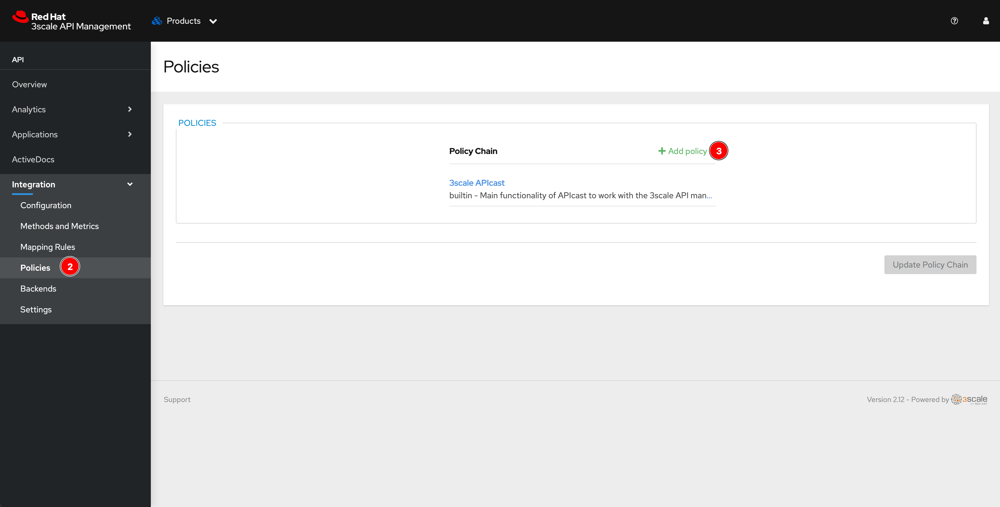

3. Look for the **IP Check** policy then click on it.

   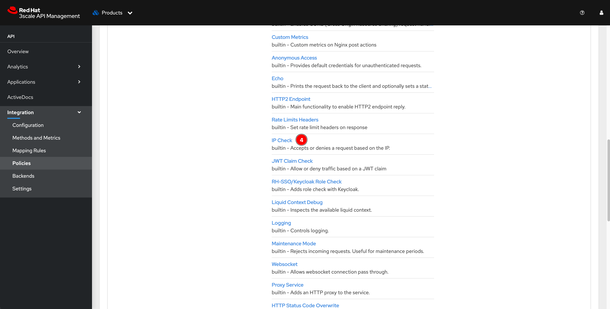

4. The policy will be added to Policy Chain. Click on the **IP Check** policy to configure it.

   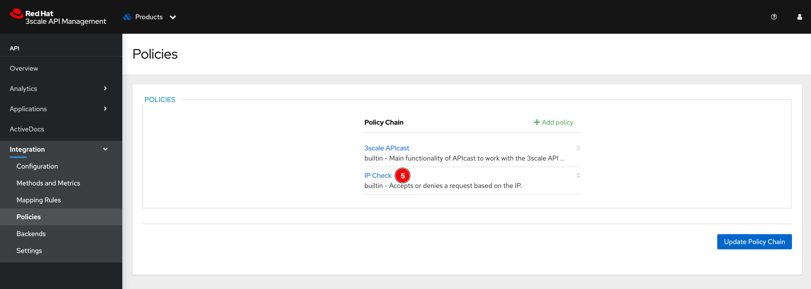

5. Enter following details, then click **Update Policy** button.

   - **Specifies how to get the client IP....:** Select `Get the IP from the X-Forwarded-For header (first IP of the list)`
   - **List of IPs:** Click **+** button and enter the IP address from [step 1](#1-get-ip-address) above.
   - **The type of check to apply:** Select `Block the IPs included in the list`

        Note. In reality, this option should be `Allow only the IPs included in the list`. But for testing and demonstration purpose, using the `Block the IPs...` option is easy to demonstrate.

   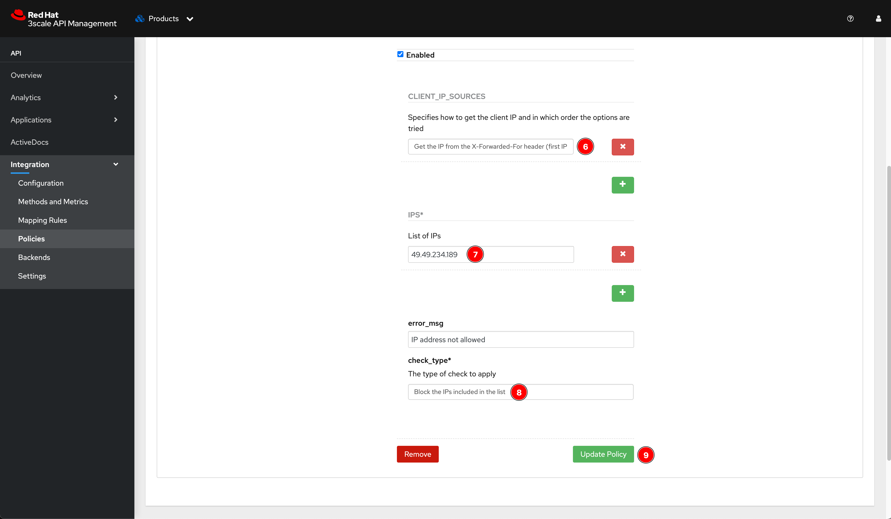

6. You'll be directed to the Policies dashboard, click on **Update Policy Chain** button.

   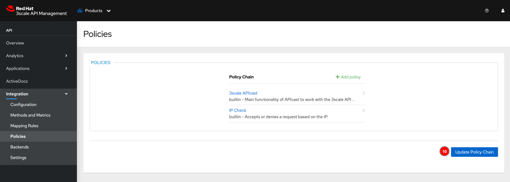

7. Select **Integration -> Configuration** menu from left panel, then click **Promote v.*n* to Staging APIcast** button and then click **Promote v.*n* to Production APIcast** button to promote the configuration to Staging APIcast and Production APIcast respectively.

   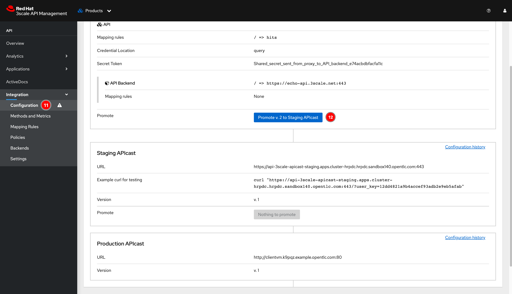

   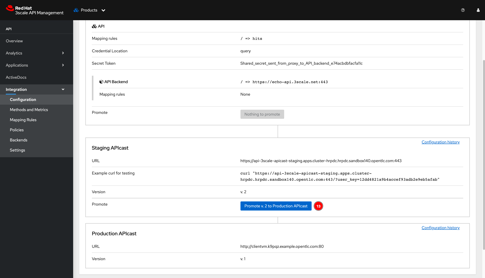

## 3. Testing

1. Open a new tab in Postman, then enter the APIcast API Gatway URL.

   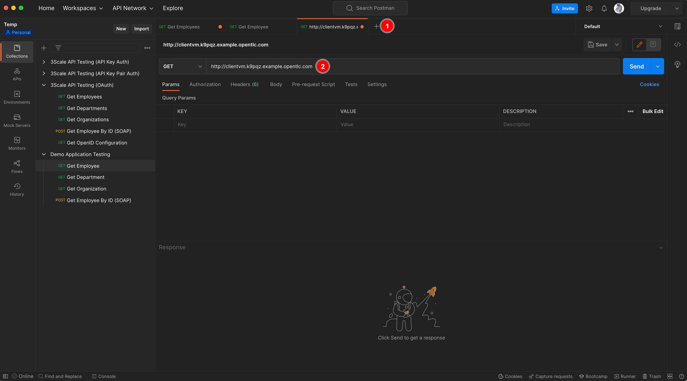

2. Copy **user_key** query parameter from 3scale web console.

   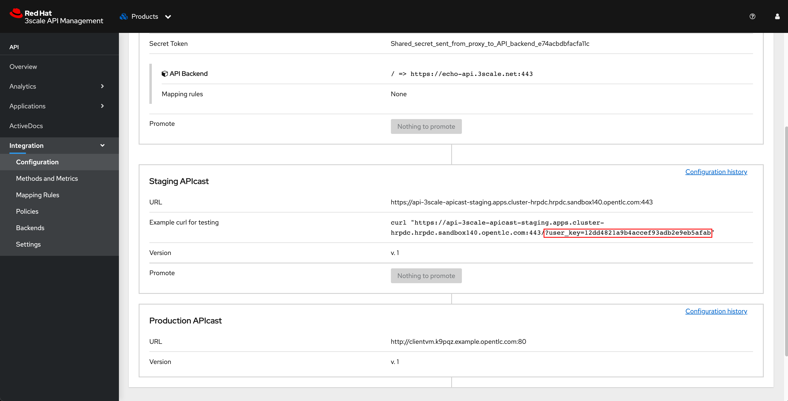

3. Append the copied **user_key** to the URL in Postman (DO NOT forget to add `/` character to the end of URL before append the `user_key` param) and click **Send** button. You should get error response says **IP address not allowed**.

   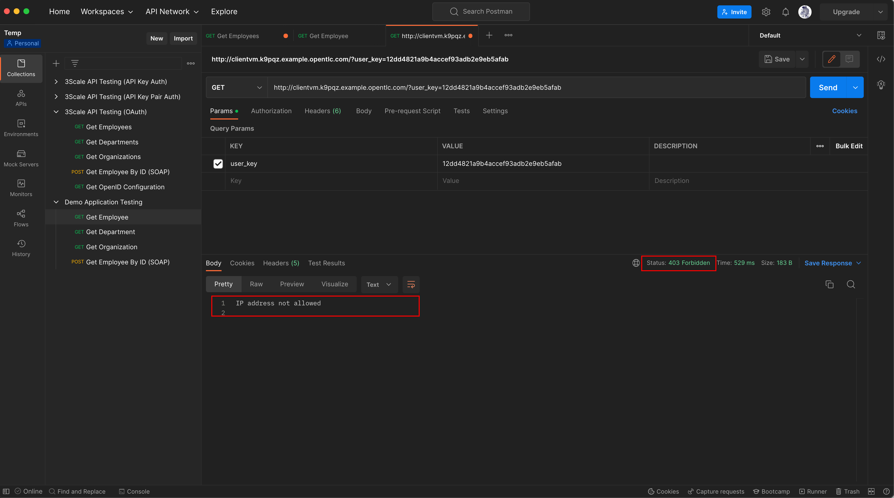
