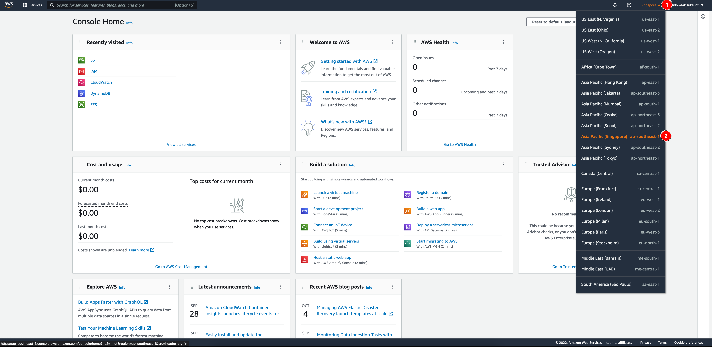
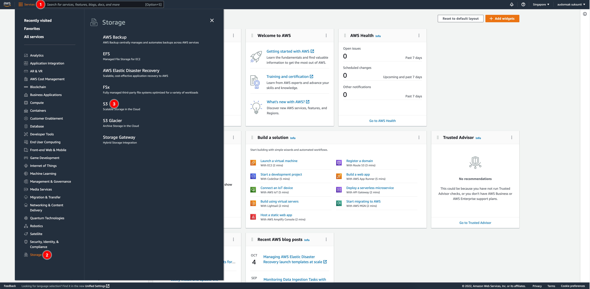
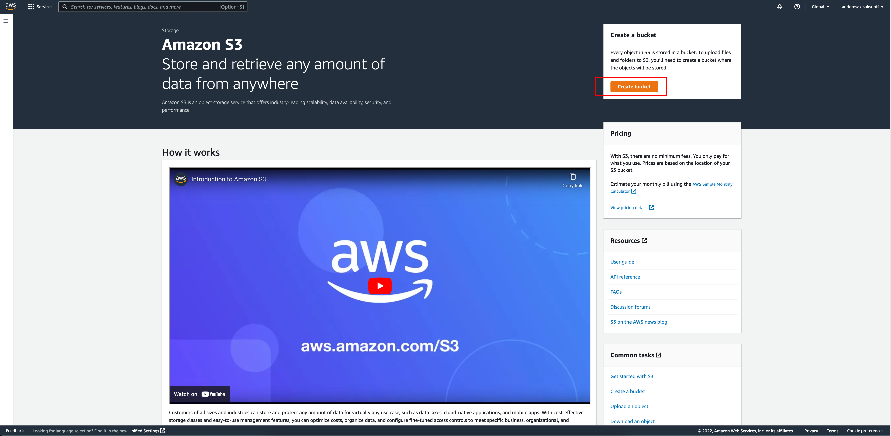
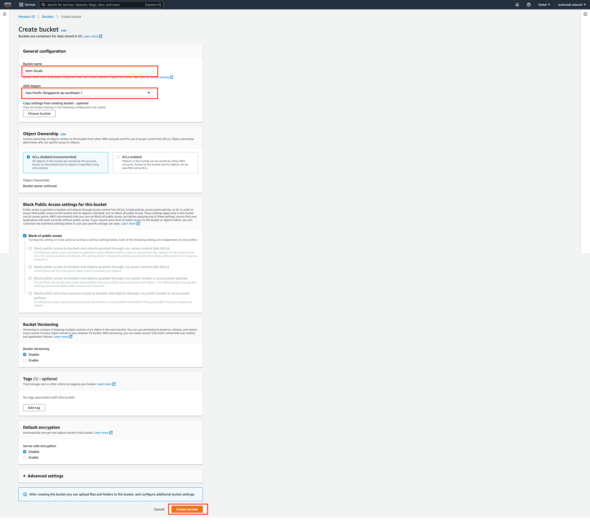
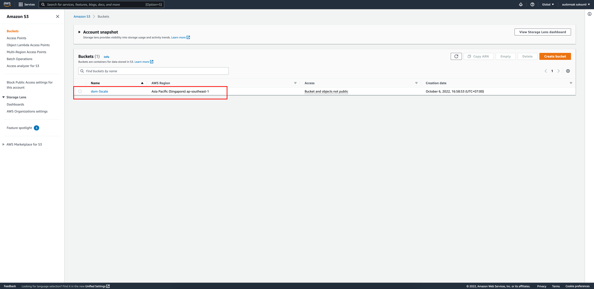
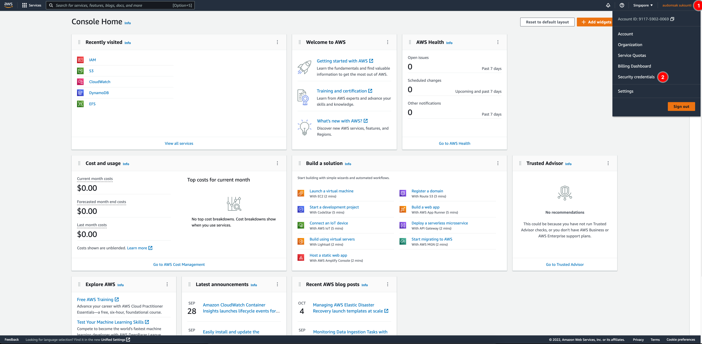
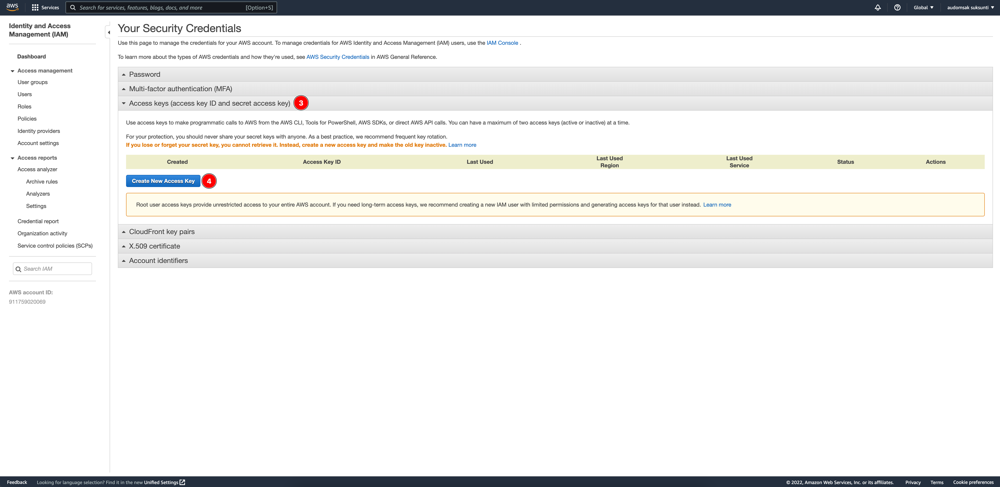
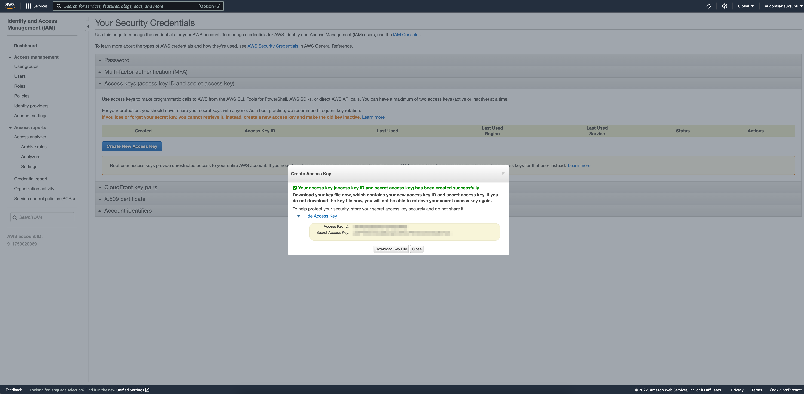

# AWS S3 Bucket Setup Guide <!-- omit in toc -->

## Table of Contents <!-- omit in toc -->

- [Create S3 Bucket](#create-s3-bucket)
- [Create Access Key](#create-access-key)

## Create S3 Bucket

1. Login to AWS console.

2. Select the region you need to use.

   

3. Open **S3** service from **Services** menu.

   

4. Click on **Create bucket** button to create a new S3 bucket.

   

5. Enter bucket name as you need (the bucket name must be unique globally), select the **AWS Region** that's closed to where your OpenShift cluster is. Then click on **Create bucket** button at the bottom.

   

6. You should be able to see a new bucket in S3 dashboard.

   

## Create Access Key

1. Click on your account name at the top right corner. Then **Security credentials** menu.

   

2. Expand the **Access keys (access key ID and secret access key)** section then click **Create New Access Key** button.

   

3. A dialog will be shown. Click **Show Access Key** to view your Access Key ID and Secret Access Key. Note these values or download them by click on **Download Key File** button.

   

---
[Go back to installation guide page](aws-s3-setup.md)
