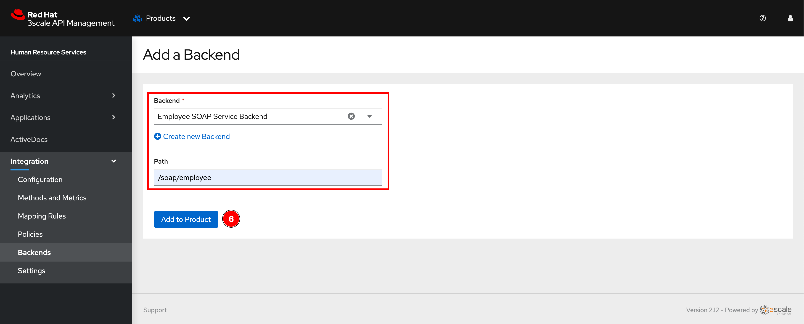

# Expose SOAP API Through API Gateway <!-- omit in toc -->

## Steps <!-- omit in toc -->

- [1. Create Backend API](#1-create-backend-api)
- [2. Add Backend to Product](#2-add-backend-to-product)
- [3. Configure Mapping Rules](#3-configure-mapping-rules)
- [4. Promote Changes to APIcasts (API Gateways)](#4-promote-changes-to-apicasts-api-gateways)
- [5. Testing](#5-testing)

## 1. Create Backend API

1. Go to OpenShift web console, make sure you're in **Administrator** perspective, change Project to **demo**, then go to **Networking -> Services** menu, and then click on the service you need to expose it's API(s) through API gateway.

   

2. Copy the **Hostname** of the service and note the port number as well. Note that we use the Service object hostname instead of the Route's URL because:
   - the API gateway (APIcast) is deployed on the same cluster so it can internally access the Service in different projects/namespaces.
   - We need API consumers to access the API via API gateway only so the (public) Route's URL shouldn't be used and should be deleted later.

   

3. Open 3scale API Management admin web console using the URL and credential provided at the end of the [installation process](../README.md#installation-steps). Then from the main dashboard, click on **Create Backend** button.

   

4. Enter following details then click **Create Backend** button.

   - **Name:** `Employee SOAP Service Backend`
   - **Private Base URL:** `http://employee-soap.demo.svc.cluster.local:8080/soap/service/employee`

   Note. **System name** and **Description** are optional fields.

   

5. A new backend should be created.

   

## 2. Add Backend to Product

1. Click on dropdown list menu then select **Product**.

   

2. Click **Human Resource Services** link.

   

3. Select **Integration -> Backends** menu from left panel.

   

4. Click **Add Backend** button.

   

5. Enter following details then click **Add to Product** button.
   - **Backend:** `Employee SOAP Service Backend`
   - **Path:** `/soap/employee`

   

6. A new backend should be added.

   

## 3. Configure Mapping Rules

1. Select **Integration -> Mapping Rules** menu from left panel, then click **Create Mapping Rule** button.

   

2. Enter following details then click **Create Mapping Rule** button.

   - **Verb:** `POST` (HTTP method for a particular API)
   - **Pattern:** `/soap/employee` (A particular REST API endpoint exposed via API gateway)
   - **method or Metric to increment:** Select `Metric` option and `Hits` from dropdown list menu.

   

3. A new Mapping Rule should be created.

   

## 4. Promote Changes to APIcasts (API Gateways)

Once we've configured everything in place in API Manager, we have to promote all changes to API Gateway (APIcast) to apply those changes.

Click on **Integration -> Configuration** menu from left panel. Then click **Promote v.*N* to Staging APIcast** button to promote changes to staging API gateway and click **Promote v.*N* to Production APIcast** button to promote changes to production API gateway.

   

## 5. Testing

1. Click on **Applications -> Listing** menu from left panel. Then click **Test Corp HR Mobile** link to open Application dashboard.

   

2. Copy User Key.

   

3. Open Postman then update `user-key` variable and click **Save** button.

   

4. [Test the APIs](testing-application.md#testing-apis) using [3Scale API Testing (API Key Auth)](../postman/3scale-api-testing-api-key-auth.postman_collection.json) collection.
