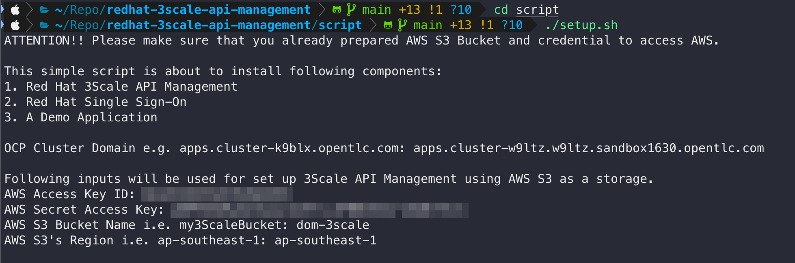
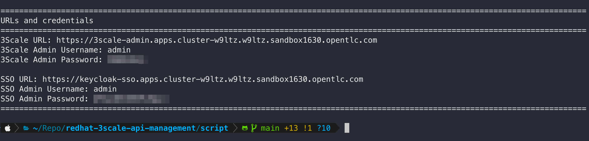

# Red Hat 3scale API Management Installation Guide

## Requirements

- Red Hat OpenShift Container Platform 4.10 cluster
- AWS Web Services account ([Create AWS Free Tier account](https://aws.amazon.com/free))
- OpenShift CLI (oc)
- [OpenSSL](https://www.openssl.org/source/) binary (should already exists on Mac and Linux)

## Installation Steps

1. [Setup AWS S3 bucket and create access key](aws-s3-setup.md)

2. Open a terminal and login to OpenShift cluster with cluster admin privilege user i.e. `opentlc-mgr` (if you provisioned the cluster from RHPDS).

3. First, clone this repository to your computer, then change directory to the [script](/script/) directory, and then run the [setup.sh](script/setup.sh) script to install and setup 3Scale and SSO operators, 3Scale API Manager instance, and SSO (Keycloak) instance.

   The script will ask for OpenShift cluster domain, AWS credential, and AWS S3 bucket information. Enter your cluster domain and AWS input like a screenshot below.

   

4. **The installation process will take a while to get completed (~20 minutes)**. At the end, the script will show you 3Scale and SSO web console URLs as well as credentials for login.

   

    In summary, these are what the setup script has done:

    - Install 3scale Operator ([yaml](../manifest/3scale/3scale-subscription.yml))
    - Create 3scale API Manager instance ([yaml](../manifest/3scale/api-manager.yml))
    - Install Single Sign-On (SSO) Operator ([yaml](../manifest/sso/sso-subscription.yml))
    - Create Keycloak instance ([yaml](../manifest/sso/keycloak.yml))
    - Create Keycloak realm ([yaml](../manifest/sso/realm.yml))
    - Create a user in the realm ([yaml](../manifest/sso/user.yml))
    - Install demo applications ([yaml](../manifest/demo-application/demo-applications.yml))
    - Add SSO certificate to Zync certificate chain so it can integrate with SSO when using SSO to secure API(s) with OAuth2.

      Note. Zync is one of components in 3scale ecosystem.

5. Setup Zync client in Keycloak so it can call Keycloak APIs.

---
[Go back to main page](../README.md)
