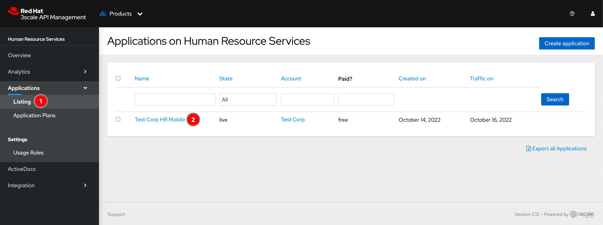
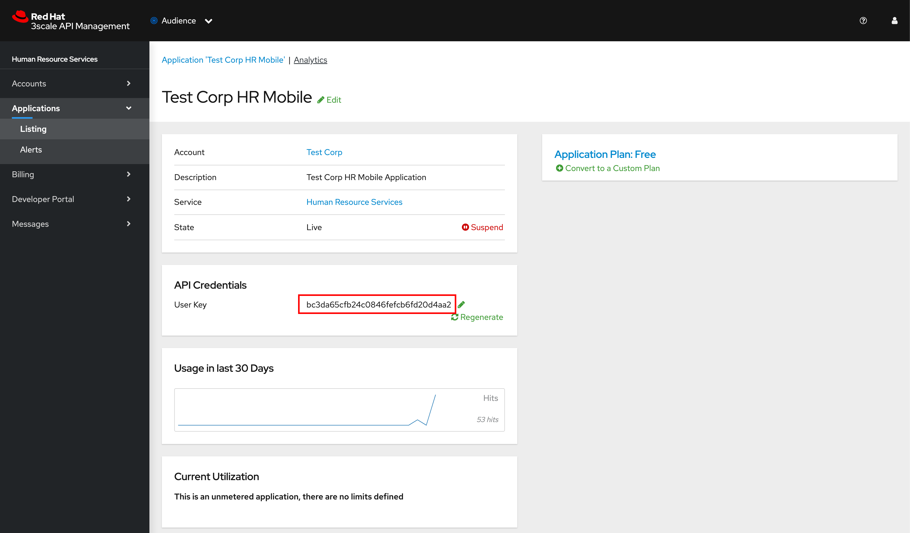
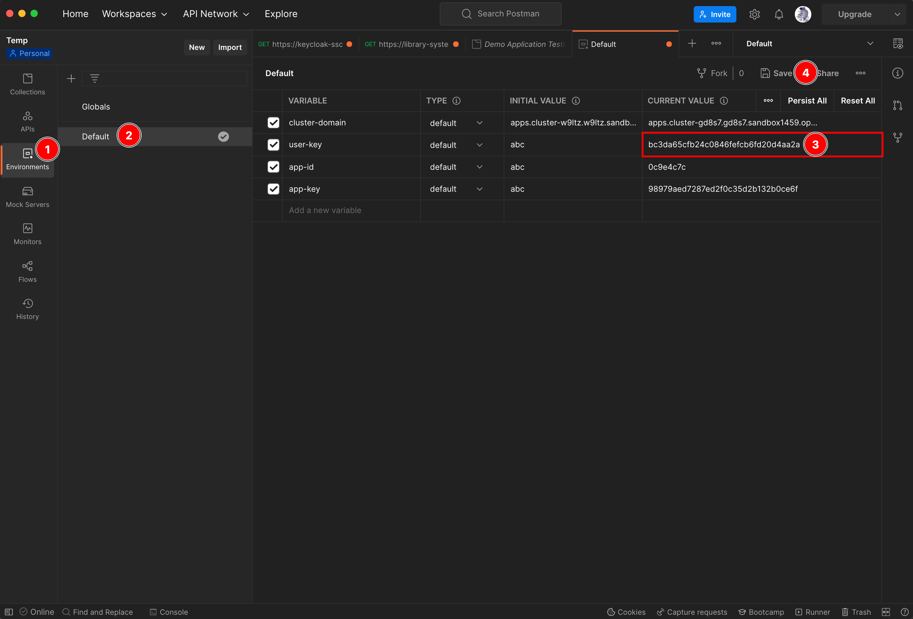

# Onboarding New API Consumer <!-- omit in toc -->

## Steps <!-- omit in toc -->

- [1. Create backend API](#1-create-backend-api)
- [2. Create an account for API consumer](#2-create-an-account-for-api-consumer)
- [3. Create a new API product](#3-create-a-new-api-product)
- [4. Create Application Plan](#4-create-application-plan)
- [5. Create Application](#5-create-application)
- [6. Configure Backend API for Product](#6-configure-backend-api-for-product)
- [7. Configure Mapping Rules](#7-configure-mapping-rules)
- [8. Configure Credential Location](#8-configure-credential-location)
- [9. Promote Changes to APIcasts (API Gateways)](#9-promote-changes-to-apicasts-api-gateways)
- [10. Testing](#10-testing)

## 1. Create backend API

1. Go to OpenShift web console, make sure you're in **Administrator** perspective, change Project to **demo**, then go to **Networking -> Services** menu, and then click on the service you need to expose it's API(s) through API gateway.

   

2. Copy the **Hostname** of the service and note the port number as well. Note that we use the Service object hostname instead of the Route's URL because:

   - the API gateway (APIcast) is deployed on the same cluster so it can internally access the Service in different projects/namespaces.
   - We need API consumers to access the API via API gateway only so the (public) Route's URL shouldn't be used and should be deleted later.

   

3. Open 3scale API Management admin web console using the URL and credential provided at the end of in the [installation process](../README.md#installation-steps). Then from the main dashboard, click on **Create Backend** button.

   

4. Enter following details then click **Create Backend** button.

   - **Name:** `Employee Service Backend`
   - **Private Base URL:** `http://employee.demo.svc.cluster.local:8080`

   Note. **System name** and **Description** are optional fields.

   

5. A new backend should be created.

   

6. Repeat the steps above to add the **Department** and **Organization** service backends.

   

## 2. Create an account for API consumer

1. Click on dropdown list menu then select **Audience**.

   

2. Click on **Create** link to create a new account.

   

3. Enter following details then click **Create** button.

   - **Username:** `testcorp`
   - **Email:** `admin@testcorp.com`
   - **Password:** `123456`
   - **Organization/Group Name:** `Test Corp`

   Note. These are just example input, in reality, these information should be configured properly.

   

4. A new account as well as a default application should be created. Note that the default application is currently associated with the **API** Product (the initial Product comes with 3scale after installation).

   However, we don't need the default application also we need to create an application and configure the associated product by ourself. So, let's delete the default application by click on the **Test Corp's App** link to open the application.

   

5. Click the **Edit** link next to the application name.

   

6. Click **Delete**. The popup will be shown then click **OK** button.

   

   

## 3. Create a new API product

1. Click on dropdown list menu then select **Product**.

   

2. Click on **Create Product** button.

   

3. Enter `Human Resource Services` in the **Name** field then click **Create Product** button.

   

4. A new API product should be created

   

## 4. Create Application Plan

1. From the Product Overview dashboard, click on **Create Application Plan** link.

   

2. Enter `Free` to the **Name** field then click **Create Application Plan** button.

   

3. Application plan should be created.

   

## 5. Create Application

1. Click on **Application -> Listing** menu from left panel.

   

2. Click **Create application** button.

   

3. Enter following details then click **Create application** button.

   - **Account:** `Test Corp`
   - **Application plan:** `Free`
   - **Name:** `Test Corp HR Mobile'
   - **Description:** `Test Corp HR Mobile Application'

   

4. A new application should be created with assigned Application Plan as well as an auto genereated API Key. This API Key will be used as a credential for API calls.

   

## 6. Configure Backend API for Product

1. Click on **Integration -> Backends** from left panel.

   

2. Click **Add Backend** button.

   

3. Enter following details then click **Add to Product** button.

   - **Backend:** `Employee Service Backend`
   - **Path:** `/employee`

   

4. Repeat the steps above to add **Department** and **Organization** Backend services.

   - **Backend:** `Department Service Backend`
   - **Path:** `/depatment`
   - **Backend:** `Organization Service Backend`
   - **Path:** `/organization`

   

## 7. Configure Mapping Rules

1. First, let's delete existing default mapping rule. Select **Integration -> Mapping Rules** menu from left panel, then click on the bin icon to delete the existing mapping rule, and then click **OK** button to confirm.

   

2. Click **Create Mapping Rule** button.

   

3. Enter following details then click **Create Mapping Rule** button.

   - **Verb:** `GET` (HTTP method for a particular API)
   - **Pattern:** `/employee/employees` (A particular REST API endpoint exposed via API gateway)
   - **method or Metric to increment:** Select `Metric` option and `Hits` from dropdown list menu.

   

4. Repeat the steps above to create Mapping Rules for the **Department** (`/department/departments`) and **Organization** (`/organization/organizations`) APIs with follwing details:

   - **Department API**
     - **Verb:** `GET`
     - **Pattern:** `/department/departments`
     - **method or Metric to increment:** Select `Metric` option and `Hits` from dropdown list menu.

   - **Organization API**
     - **Verb:** `GET`
     - **Pattern:** `/organization/organizations`
     - **method or Metric to increment:** Select `Metric` option and `Hits` from dropdown list menu.

   

## 8. Configure Credential Location

By default, 3scale will use **API Key** as an authentication mode. API consumer must provide the given API Key (credential) along with each API request when sending the request to API Gateway. Again, by default, 3scale will be looking for the credential (API Key) from query paramenters or body parameters based on HTTP methods.

1. Click on **Integration -> Settings** menu from left panel. Under the **CREDENTIALS LOCATION** section, select **As HTTP Headers** option.

   

2. Scroll down to the bottom of the page then click **Update Product** button.

   

## 9. Promote Changes to APIcasts (API Gateways)

Once we've configured everything in place in API Manager, we have to promote all changes to API Gateway (APIcast) to apply those changes.

1. Click on **Integration -> Configuration** menu from left panel. Then click **Promote v.1 to Staging APIcast** button to promote changes to staging API gateway.

   

2. Then click **Promote v.1 to Production APIcast** button to promote changes to production API gateway.

   

3. The URLs for both staging and production should be displayed.

   

## 10. Testing

1. Click on **Applications -> Listing** menu from left panel. Then click **Test Corp HR Mobile** link to open Application dashboard.

   

2. Copy User Key.

   

3. Open Postman then update `user-key` variable and click **Save** button.

   

4. [Test the APIs](testing-application.md#testing-apis) using [3Scale API Testing (API Key Auth)](../postman/3scale-api-testing-api-key-auth.postman_collection.json) collection.
