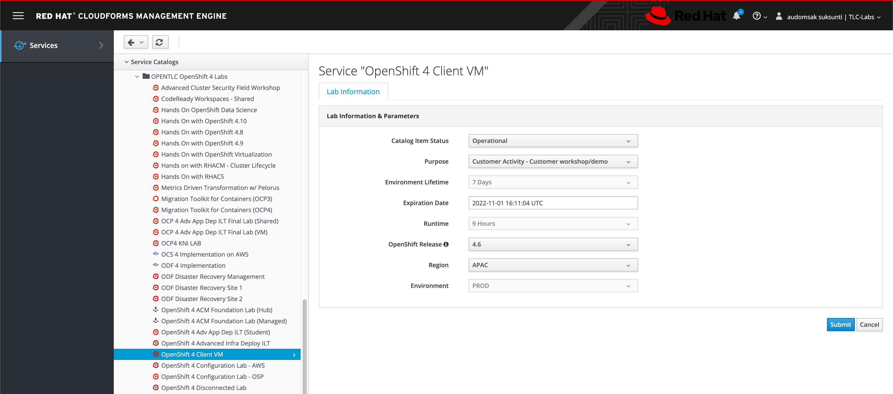
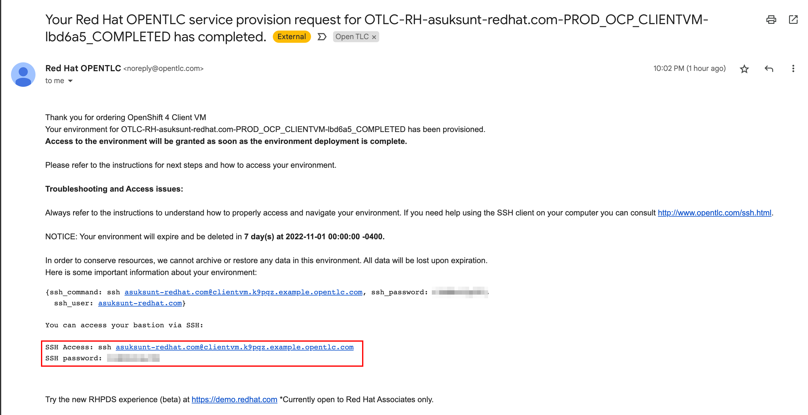

# Virtual Machine Preparation

1. Request **OpenShift 4 Client VM** from [labs.opentlc.com](https://labs.opentlc.com/)

    

2. You'll get an email after VM gets provisioned successfully. SSH to VM with the credential in the mail.

    

3. After login to VM, switch to **root** user with this command.

    ```sh
    sudo -i
    ```

4. Verify if **podman** is installed.

    ```sh
    podman version
    ```

    Sample output:

    ```text
    Version:            1.6.4
    RemoteAPI Version:  1
    Go Version:         go1.12.12
    OS/Arch:            linux/amd64
    ```

5. Install **firewalld** with this command so you can configure firewall rule.

    ```sh
    yum install -y firewalld
    ```

6. Start **firewalld** service with this command.

    ```sh
    systemctl start firewalld
    ```

7. Verify if **firewalld** service started successfully.

    ```sh
    systemctl status firewalld
    ```

    Sample output:

    ```text
    ● firewalld.service - firewalld - dynamic firewall daemon
    Loaded: loaded (/usr/lib/systemd/system/firewalld.service; enabled; vendor preset: enabled)
    Active: active (running) since Tue 2022-10-25 15:39:44 UTC; 49min ago
        Docs: man:firewalld(1)
    Main PID: 30795 (firewalld)
    CGroup: /system.slice/firewalld.service
            └─30795 /usr/bin/python2 -Es /usr/sbin/firewalld --nofork --nopid
    ```

8. Allow incomming traffic on port **80**.

    ```sh
    firewall-cmd --zone=public --add-port=80/tcp --permanent
    firewall-cmd --reload
    ```
