# Limit API calls using Rate Limit <!-- omit in toc -->

## Steps <!-- omit in toc -->

- [1. Create Application Plan](#1-create-application-plan)
- [2. Configure Usage Limit at Product Level](#2-configure-usage-limit-at-product-level)
- [3. Configure Usage Limit at Backend (API) Level - An alternative to Product Level](#3-configure-usage-limit-at-backend-api-level---an-alternative-to-product-level)
- [4. Change Application Plan for Application](#4-change-application-plan-for-application)
- [5. Testing](#5-testing)

## 1. Create Application Plan

1. From main dashboard, click **Human Resource Services** link to open Product dashboard page.

   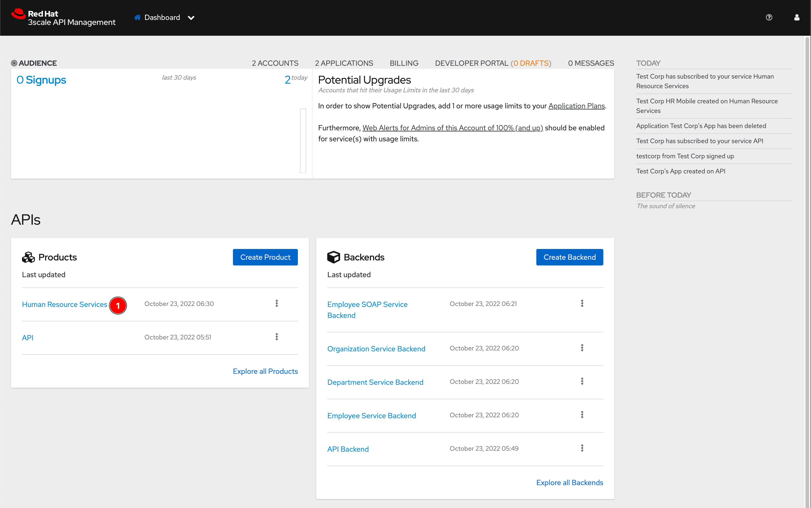

2. Click **Create Application Plan** link.

   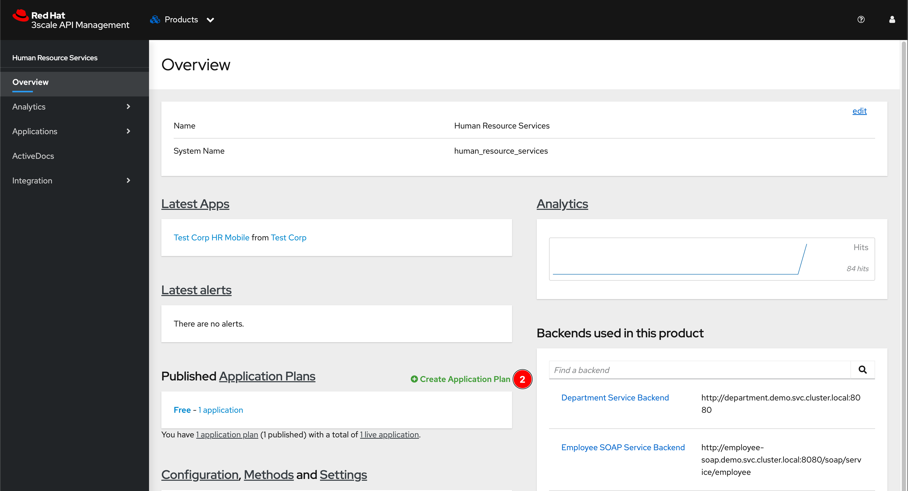

3. Enter `Limit` in the **Name** field then click **Create Application Plan** button.

   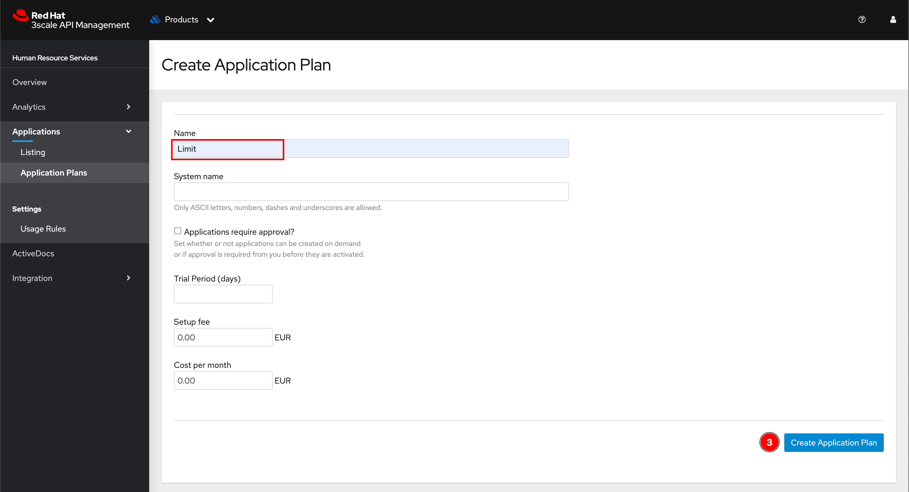

4. Click 3 dots menu then select **Publish**.

   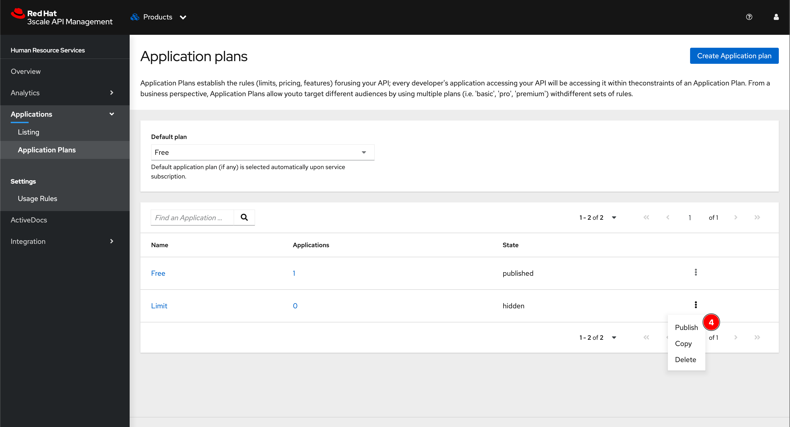

## 2. Configure Usage Limit at Product Level

1. From Application Plans dashboard, click on the **Limit** application plan.

   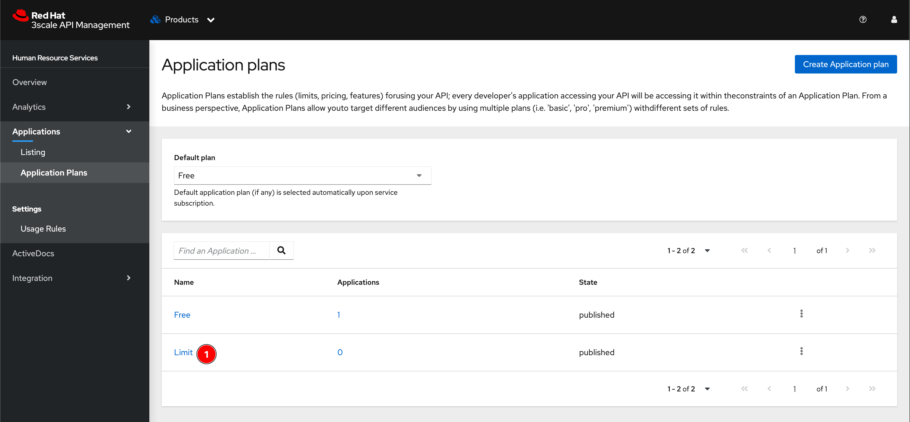

2. Click on **Limit (*n*)** link to open Limits panel. Then click **New usage limit** link to open setting dialog.

   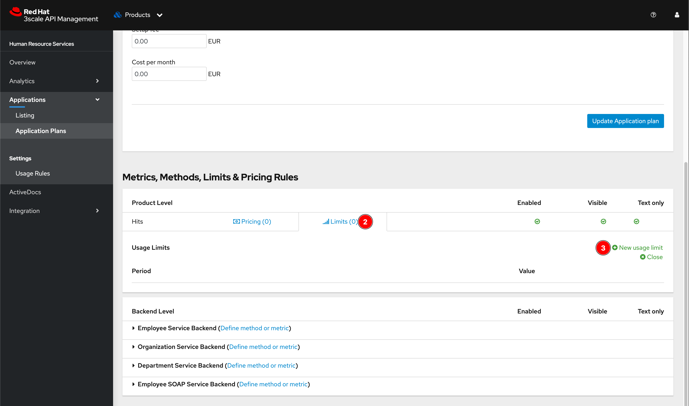

3. Select the Period unit and enter the number of calls that are allowed for 1 period unit. In this case, `10` API calls are allowed for each `minute`. Then click **Create usage limit** button.

   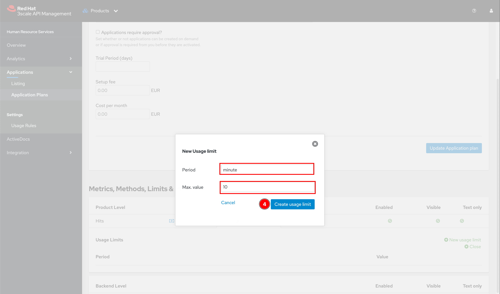

4. A usage limit should be created.

   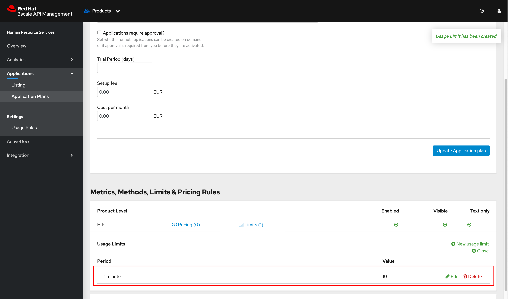

## 3. Configure Usage Limit at Backend (API) Level - An alternative to Product Level

Instead of configure usage limit at product level which the number of API calls are counted from every backend APIs, you can also configure usage limit at each backend API to have different usage limit as well.

The steps are almost the same as Product level configure except you have to do at Backend level as a figure below.

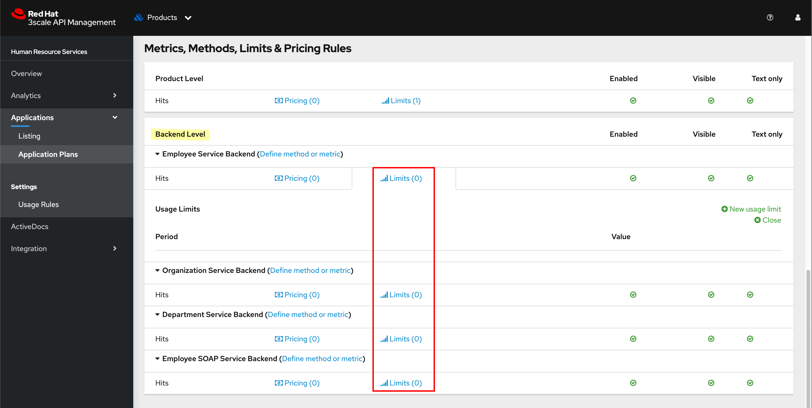

## 4. Change Application Plan for Application

1. Select **Application -> Listing** menu from left panel.

   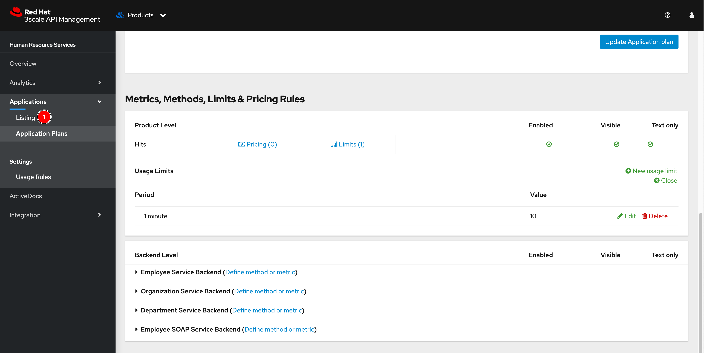

2. Click **Test Corp HR Mobile** link to open application dashboard.

   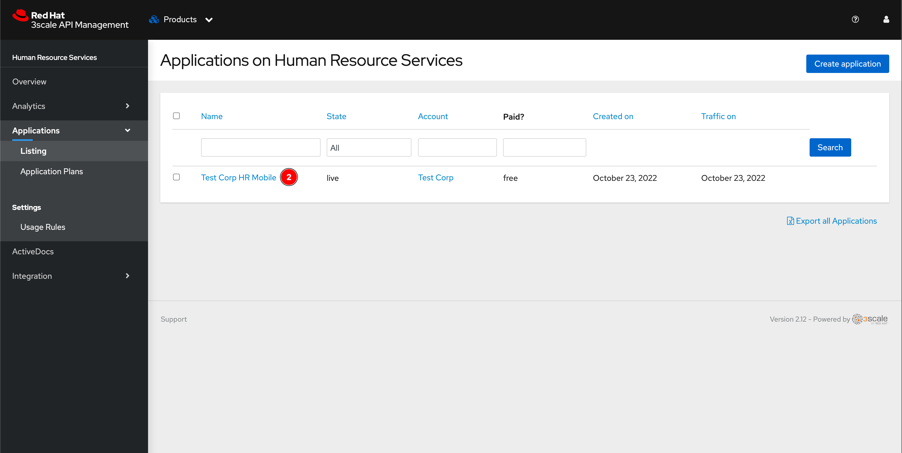

3. In **Change plan** panel, select the **Limit** application plan then click **Change plan** button.

   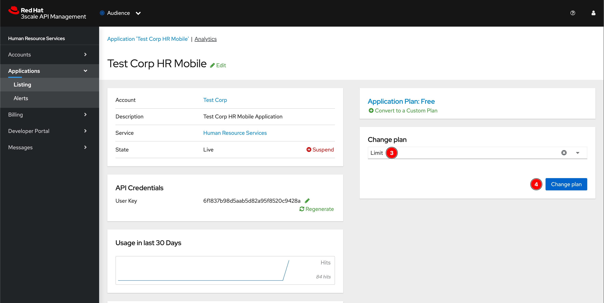

4. The Application Plan for the application should be changed.

   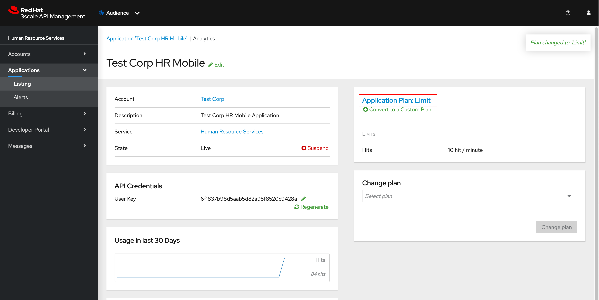

5. Configure and change Application Plan do not require configuration promotion. If you go to Product's configuration menu, you'll see it says nothing to promote.

   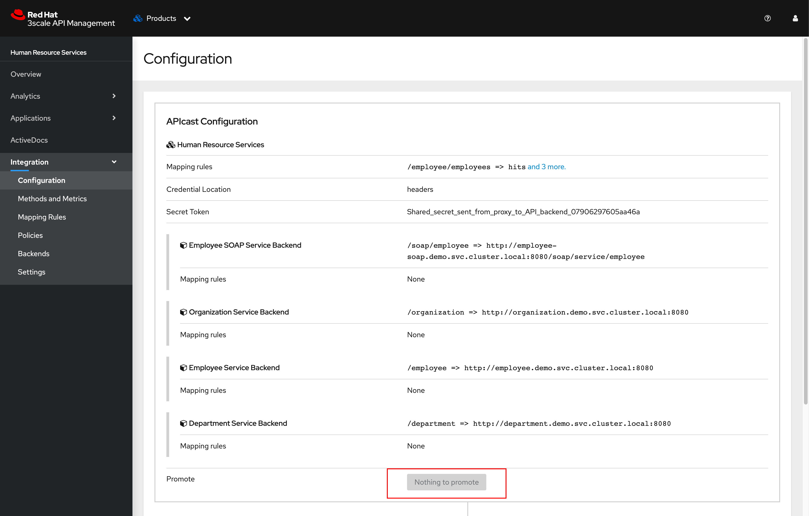

## 5. Testing

1. [Test the APIs](testing-application.md#testing-apis) using [3Scale API Testing (API Key Pair Auth)](../postman/3scale-api-testing-api-key-pair-auth.postman_collection.json) collection.

2. Send any API request more than 10 times within 1 minute, you should get `HTTP 429` status code as well as `Usage limit exceeded` message returned from API gateway as a screenshot below.

   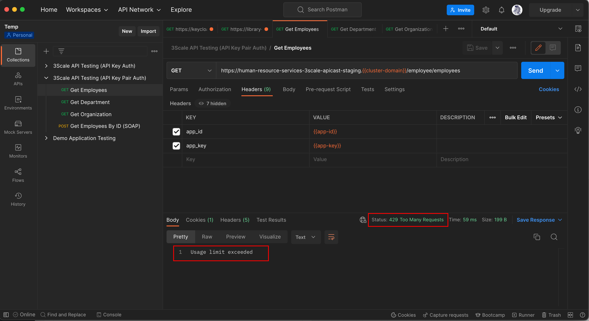
