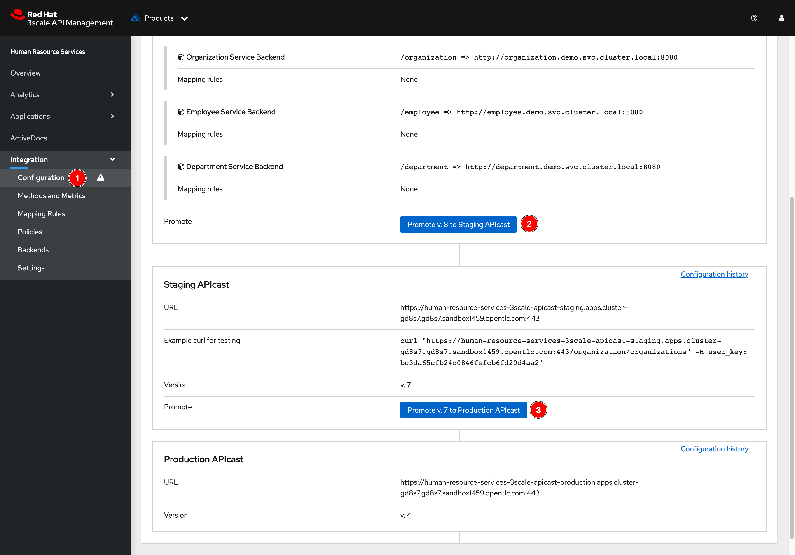

# Secure API with API Key-pair <!-- omit in toc -->

## Steps <!-- omit in toc -->

- [1. Configure Authentication Method for API Product](#1-configure-authentication-method-for-api-product)
- [2. Generate Key for Application](#2-generate-key-for-application)
- [3. Promote Changes to APIcasts (API Gateways)](#3-promote-changes-to-apicasts-api-gateways)
- [4. Testing](#4-testing)

## 1. Configure Authentication Method for API Product

1. Click on dropdown list menu then select **Products**. And then click on **Human Resource Services** link to open product dashboard.

   

2. Select **Integration -> Settings** menu from left panel. Then select **App_ID and App_Key Pair The application is identified...** option.

   

3. Scroll down to the bottom of the page then click **Update Product** button.

   

## 2. Generate Key for Application

1. Select **Applications -> Listing** menu from left panel. Then click **Test Corp HR Mobile** link.

   

2. Click **Add Random key** link to generate a random Application key.

   

3. An Application key should be generated. This key pair (
Application ID and Application key) will be used as a credential for API calls.

   

## 3. Promote Changes to APIcasts (API Gateways)

1. Click on Back button of web browser to go back to previous page.

   

2. Select **Integration -> Configuration** menu from left panel. Then click **Promote v.*N* to Staging APIcast** button to promote changes to staging API gateway and click **Promote v.*N* to Production APIcast** button to promote changes to production API gateway.

   

## 4. Testing

1. Open Application dashboard following [these steps](#2-generate-key-for-application), then use **Application ID** and **Application key** values to update Postman environment variables.

   

2. Open Postman then update `app-id` and `app-key` variables, and then click **Save** button.

      

3. [Test the APIs](testing-application.md#testing-apis) using [3Scale API Testing (API Key Pair Auth)](../postman/3scale-api-testing-api-key-pair-auth.postman_collection.json) collection.
