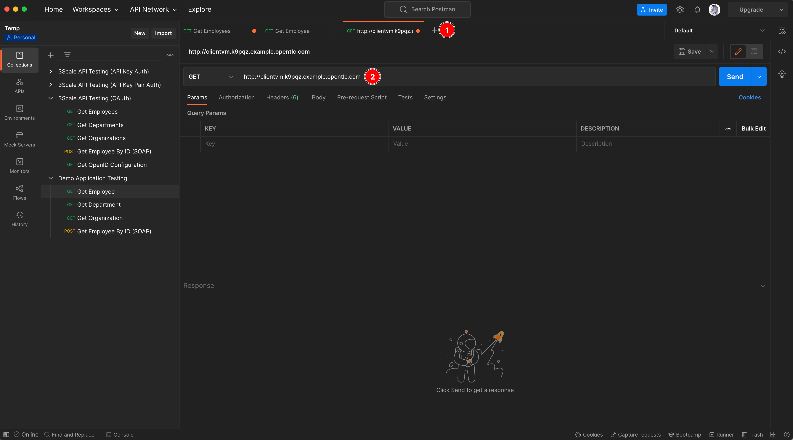
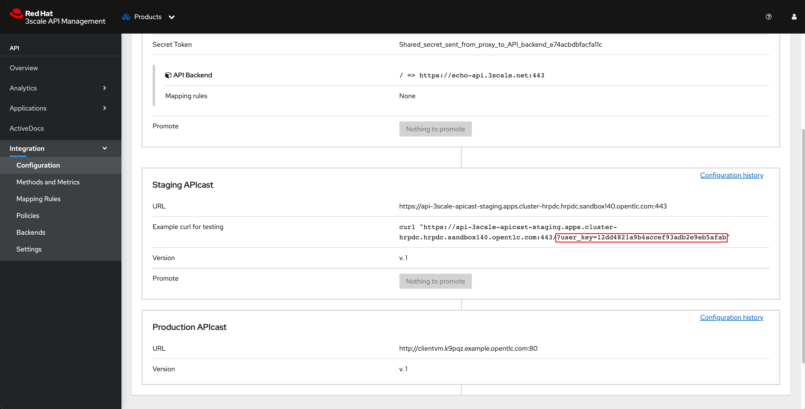

# Running Self-Managed API Gateway On VM<!-- omit in toc -->

## Requirement <!-- omit in toc -->

- VM with Podman or Docker installed. See [preparing VM](prepare-vm.md)

## Steps <!-- omit in toc -->

- [1. Generate Access Token For API Gateway (APIcast)](#1-generate-access-token-for-api-gateway-apicast)
- [2. Running APIcast (API Gateway) Container](#2-running-apicast-api-gateway-container)
- [3. Promote 3scale Configuration to Self-Managed API Gateway](#3-promote-3scale-configuration-to-self-managed-api-gateway)
- [4. Testing](#4-testing)

## 1. Generate Access Token For API Gateway (APIcast)

1. From main dashboard, select **Account Settings** from dropdown list menu.

   

2. Select **Personal -> Tokens** menu from left panel, then click **Add Access Token** link.

   

3. Enter following details, then click **Create Access token** button.

   - **Name:** `Local Gateway`
   - **Scopes:** Select `Account Management API`
   - **Permission:** `Read Only`

   

4. Copy the token to somewhere you can recall later. Then click **I have copied the token** button.

   

5. A new access token should be created.

   

## 2. Running APIcast (API Gateway) Container

1. Login to VM via SSH.

2. Switch to **root** user with this command.

    ```sh
    sudo -i
    ```

3. Use **podman** to login to Red Hat Registry with your Red Hat account.

    ```sh
    podman docker login registry.redhat.io
    Username: {REGISTRY-SERVICE-ACCOUNT-USERNAME}
    Password: {REGISTRY-SERVICE-ACCOUNT-PASSWORD}
    Login Succeeded!
    ```

4. Run the [APIcast container](https://catalog.redhat.com/software/containers/3scale-amp2/apicast-gateway-rhel8/5df398c85a13466876712703) with this command. **DO NOT** forget to replace following vaiables:
   - **ACCESS_TOKEN:** the access token generated in 3scale [above](#1-generate-access-token-for-api-gateway-apicast).
   - **DOMAIN:** the OpenShift cluster domain i.e. `cluster-hrpdc.hrpdc.sandbox140.opentlc.com`. You can use `oc whoami --show-console|awk -F'apps.' '{print $2}'` command to get the domain value.

   ```sh
   podman run \
   --name apicast \
   --rm -d \
   -p 80:8080 \
   -e APICAST_CONFIGURATION_CACHE=5 \
   -e THREESCALE_PORTAL_ENDPOINT=https://<ACCESS_TOKEN>@3scale-admin.apps.<DOMAIN> \
   registry.redhat.io/3scale-amp2/apicast-gateway-rhel8:3scale2.12
   ```

5. Test if you can access APIcast. Replace `VM_HOSTNAME` with the actual VM hostname in the email after [VM provisioning](prepare-vm.md). Don't worry about HTTP 404 Not Found at the moment.

   ```sh
   curl -v http://<VM_HOSTNAME>
   ```

   Sample output:

   ```text
   * About to connect() to clientvm.k9pqz.example.opentlc.com port 80 (#0)
   *   Trying 18.139.181.122...
   * Connected to clientvm.k9pqz.example.opentlc.com (18.139.181.122) port 80 (#0)
   > GET / HTTP/1.1
   > User-Agent: curl/7.29.0
   > Host: clientvm.k9pqz.example.opentlc.com
   > Accept: */*
   >
   < HTTP/1.1 404 Not Found
   < Server: openresty
   < Date: Tue, 25 Oct 2022 15:41:57 GMT
   < Content-Type: text/plain
   < Transfer-Encoding: chunked
   < Connection: keep-alive
   <
   * Connection #0 to host clientvm.k9pqz.example.opentlc.com left intact
   ```

## 3. Promote 3scale Configuration to Self-Managed API Gateway

1. Switch to 3scale admin web console, click **API** link in the **Products** panel from the main dashboard.

   

   **Note.** The reason we use the **API** product for demonstration is because we're running APIcast outside OpenShift cluster so if we use the **Human Resource Services** product then the APIcast won't be able to forward incomming reqeusts to the backend APIs due to we've configured the backend APIs using local/in-cluster URLs i.e. `employee.demo.svc.cluster.local` which is accessible only within OpenShift cluster.

   However, the **API** product has a backend API configured with public URL that's accessible over internet so APIcast running on VM will be able to access the API as well.

2. Select **Integration -> Settings** menu from left panel. Then replace **Production Public Base URL** with `http://<VM_HOSTNAME>` where the `VM_HOSTNAME` is the hostname of VM that's running APIcast.

   

3. Scroll down to bottom of the page, then click **Update Product** button.

   

4. Select **Integration -> Configuration** menu from left panel. Then promote configuration to both **Staging** and **Production** environments.

   

5. You'll see that the Production APIcast URL gets changed to the APIcast running on VM.

   

## 4. Testing

1. Open a new tab in Postman, then enter the APIcast API Gatway URL.

   

2. Copy **user_key** query parameter from 3scale web console.

   

3. Append the copied **user_key** to the URL in Postman (DO NOT forget to add `/` character to the URL before append the `user_key` param) and click **Send** button. You should get response back from API Gateway.

   
