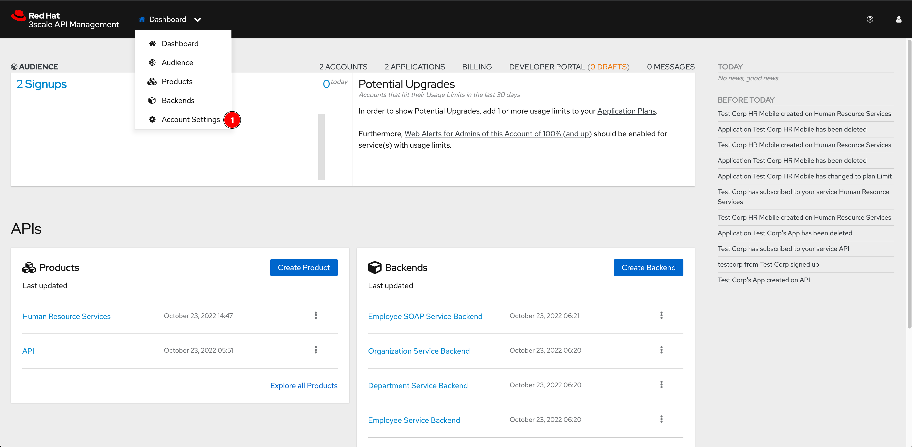
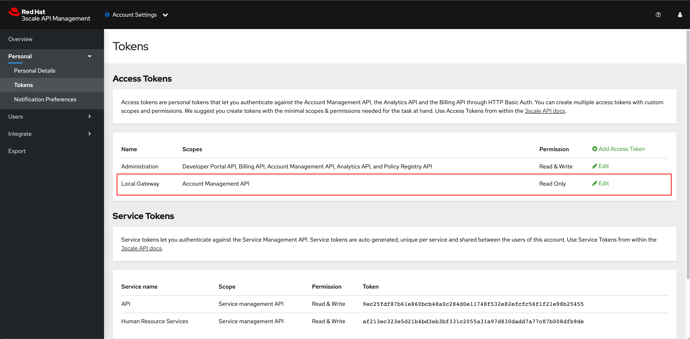
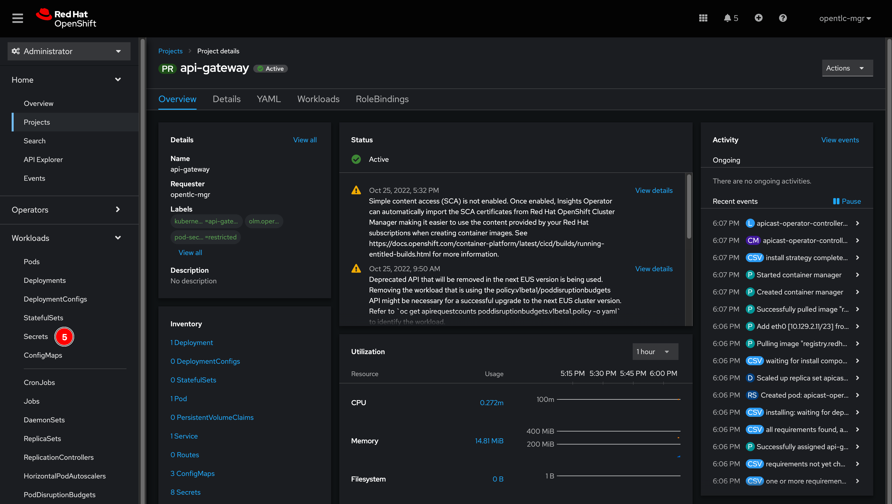
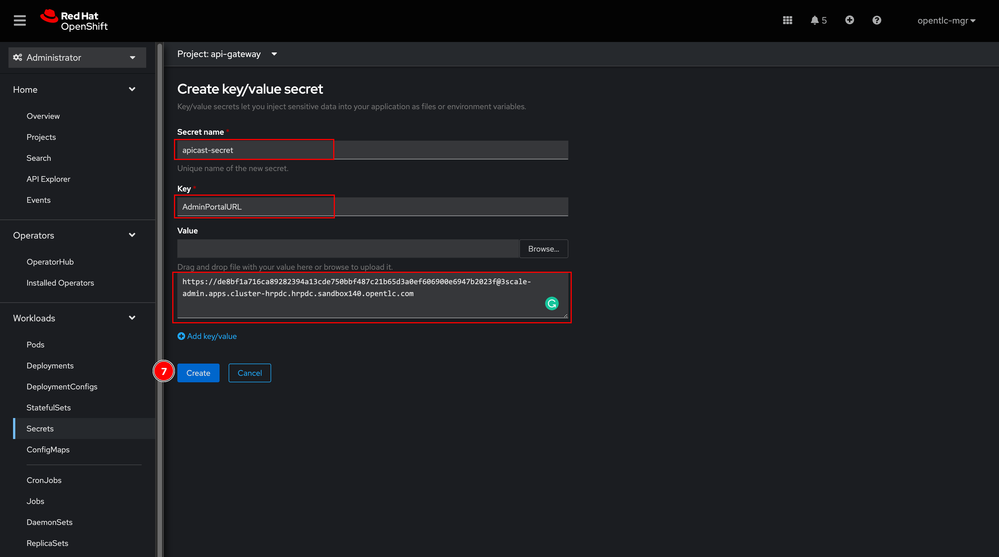
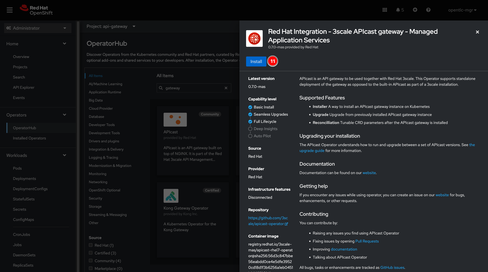

# Self-Managed API Gateway On OpenShift<!-- omit in toc -->

## Steps <!-- omit in toc -->

- [1. Create Access Token For API Gateway (APIcast)](#1-create-access-token-for-api-gateway-apicast)
- [2. Install 3scale APIcast Operator](#2-install-3scale-apicast-operator)
- [3. Setup APIcast API Gateway](#3-setup-apicast-api-gateway)
- [4. Promote 3scale Configuration to Self-Managed API Gateway](#4-promote-3scale-configuration-to-self-managed-api-gateway)
- [5. Testing](#5-testing)

## 1. Create Access Token For API Gateway (APIcast)

1. From main dashboard, select **Account Settings** from dropdown list menu.

   

2. Select **Personal -> Tokens** menu from left panel, then click **Add Access Token** link.

   

3. Enter following details, then click **Create Access token** button.

   - **Name:** `Local Gateway`
   - **Scopes:** Select `Account Management API`
   - **Permission:** `Read Only`

   

4. Copy the token to somewhere you can recall later. Then click **I have copied the token** button.

   

5. A new access token should be created.

   

## 2. Install 3scale APIcast Operator

1. Login to OpenShift web console, and switch to **Administrator** perspective. Select **Home -> Projects** menu from left panel, then click **Create Project** button.

   

2. Enter following details, then click **Create** button.

    - **Name:** `api-gateway`
    - **Display name:** `API Gateway`

   

3. The project should be created. Then Select **Workloads -> Secrets** menu from left panel.

   

4. Make sure the current project is **api-gateway** you've just created. Then click on **Create** button.

   

5. Enter following details, then click **Create** button.

    - **Secret name:** `apicast-secret`
    - **Key:** `AdminPortalURL`
    - **Value:** Enter 3scale admin portal URL in this format: `https://<ACCESS_TOKEN>@3scale-admin.apps.<DOMAIN>` where the `ACCESS_TOKEN` is the access token you've created in 3scale. And `DOMAIN` is the OpenShift cluster domain (You can use `oc whoami --show-console|awk -F'apps.' '{print $2}'` command to get the domain value. Or just copy from the URL in web browser.)

   

6. The secret should be created.

   

7. Select **Operators -> OperatorHub** menu from left panel.

   

8. Enter `gateway` in search box then select `Red Hat Integration - 3scale APIcast gateway...`

   

9. A panel will be show on the right side, click **Install** button.

   

10. Select follwing options, then click **Install** button.

    - **Update channel:** `threescale-2.12`
    - **Installation mode:** `A specific namespace on the cluster`
    - **Installed Namespace:** `api-gateway`

    

11. Wait until the operator get installed successfully. Then click **View Operator** button.

    

## 3. Setup APIcast API Gateway

1. Click **Create instance** link to create APIcast (API Gateway) instance.

    

2. Switch to **YAML view** then replace the existing code snippet with the snippet below. **DO NOT** forget to replace `CLUSTER_DOMAIN` with the OpenShift cluster domain (just copy from the URL in web browser.) Then click **Create** button.

    ```yaml
    apiVersion: apps.3scale.net/v1alpha1
    kind: APIcast
    metadata:
    name: prod-gateway
    namespace: api-gateway
    spec:
    adminPortalCredentialsRef:
        name: apicast-secret
    deploymentEnvironment: production
    exposedHost:
        host: api-gateway.apps.<CLUSTER_DOMAIN>
        tls:
        - {}
    ```

    

3. A new instance of APIcast should be created. Select **Networking -> Routes** to see the API Gateway route.

    

4. A new route should be created as per the `.exposedHost.host` value in the YAML configuration above. Copy the route URL clipboard or somewhere you can recall becasue you'll need this to configure 3scale.

    

## 4. Promote 3scale Configuration to Self-Managed API Gateway

1. Switch to 3scale admin web console, click **Human Resource Services** link in the **Products** panel from the main dashboard.

    

2. Select **Integration -> Settings** menu from left panel. Then replace the **Production Public Base URL** with the APIcast (API Gateway) route URL.

    

3. Scroll down to bottom of the page then click **Update Product** button.

    

4. Select **Integaration -> Configuration** menu from left panel. Then click **Promote v.*n* to Staging APIcast** button. And then click **Promote v.*n* to Production APIcast** button as well.

    

5. The Production APIcast URL should be changed to the new APIcast URL now.

    

## 5. Testing

1. Change API Gateway URL in Postman to the new URL.

    

2. [Test the API secured with OAuth](testing-application.md#testing-api-secured-with-oauth) using [3Scale API Testing (OAuth)](../postman/3scale-api-testing-oauth.postman_collection.json) collection.
