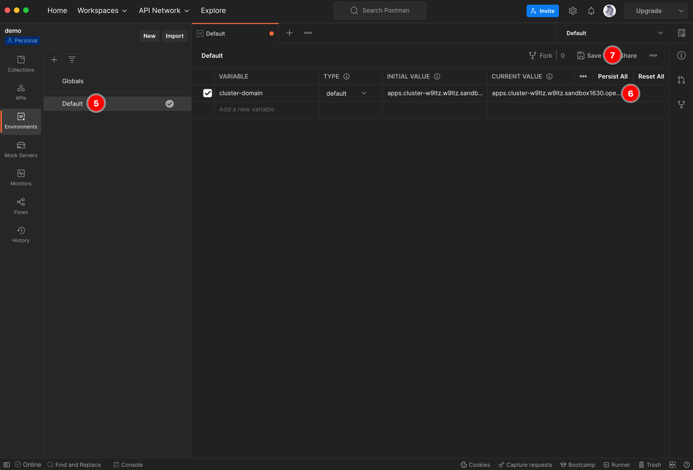

# Testing Demo Applications <!-- omit in toc -->

There are 4 microservices deployed in the cluster by the [setup.sh](../script/setup.sh) script. Three of them expose a few REST APIs and another one exposes SOAP APIs.

Those services that expose REST APIs come with Swagger UI to which you can use testing the APIs in each service. However, you can also use Postman to test both of REST APIs and SOAP APIs as well.

## Postman Collection and Environment <!-- omit in toc -->

There are 4 Postman collections you can use for API testing:

1. [Demo Application Testing](../postman/demo-application-testing.postman_collection.json) - Used for testing the APIs exposed by microservices through the OpenShift Route directly.
2. [3Scale API Testing (API Key Auth)](../postman/3scale-api-testing-api-key-auth.postman_collection.json) - Used for testing the APIs exposed through API Gateway using **API Key** as a credential for authentication.
3. [3Scale API Testing (API Key Pair Auth)](../postman/3scale-api-testing-api-key-pair-auth.postman_collection.json)  - Used for testing the APIs exposed through API Gateway using **Application ID** and **Application Key** pair as a credential for authentication.
4. 3Scale API Testing (OAuth)  - Used for testing the APIs exposed through API Gateway using OAuth2 authentication.

There is also a [Postman Environment file](../postman/default.postman_environment.json) contains all environment vairables used by the collections. The enviroment variables are used to store values e.g. cluster domain, credentials etc.

## Requirements <!-- omit in toc -->

- [Postman](https://www.postman.com/downloads/)

## Table of Contents <!-- omit in toc -->

- [Testing REST APIs via Swagger UI](#testing-rest-apis-via-swagger-ui)
- [Testing REST and SOAP APIs with Postman](#testing-rest-and-soap-apis-with-postman)
  - [Import Postman Collections and Environments](#import-postman-collections-and-environments)
  - [Testing APIs](#testing-apis)

## Testing REST APIs via Swagger UI

1. Open a route for the service that you need to test.

   

2. Append `/swagger-ui` at the end of URL then press `Enter`. You should be able to see Swagger UI page that shows all REST API endpoints exposed by the service.

   

3. Click on the endpoint you need to test, the panel will expand. Then click on **Try it out** button.

   

4. Enter paramenter(s) (if necessary), then click **Execute** button. The request URL and response will be shown up like a screenshot below.

   

## Testing REST and SOAP APIs with Postman

### Import Postman Collections and Environments

1. Create a new workspace.

   

   

2. Import these [Postman collections](/postman/) into the workspace.

   

   

   

   

3. Import this [Postman Environments](../postman/default.postman_environment.json) into the workspace.

   

   

   

4. Edit Postman `cluster-domain` environment variable by replacing the OpenShift cluster domain you've provisioned in the **CURRENT VALUE** colume. Then click **Save** button.

   

### Testing APIs

1. Select **Collection** panel.
2. Open the request you need to test.
3. Make sure you've select the **Default** environment.
4. Click **Send** button to send request to server.

   
