# Testing Demo Applications <!-- omit in toc -->

There are 4 microservices deployed in the cluster by the [setup.sh](../script/setup.sh) script. Three of them expose a few REST APIs and another one exposes SOAP APIs.

Those services that expose REST APIs come with Swagger UI which you can use to test the APIs in each service. However, you can also use Postman to both of REST APIs and SOAP APIs as well.

## Requirements <!-- omit in toc -->

- [Postman](https://www.postman.com/downloads/)

## Table of Contents <!-- omit in toc -->

- [Testing REST APIs via Swagger UI](#testing-rest-apis-via-swagger-ui)
- [Testing REST and SOAP APIs with Postman](#testing-rest-and-soap-apis-with-postman)
  - [Import Postman Collections and Environments](#import-postman-collections-and-environments)
  - [Testing APIs exposed through services directly](#testing-apis-exposed-through-services-directly)
  - [Testing APIs exposed through API gateway](#testing-apis-exposed-through-api-gateway)

## Testing REST APIs via Swagger UI

1. Open a route for the service that you need to test.

   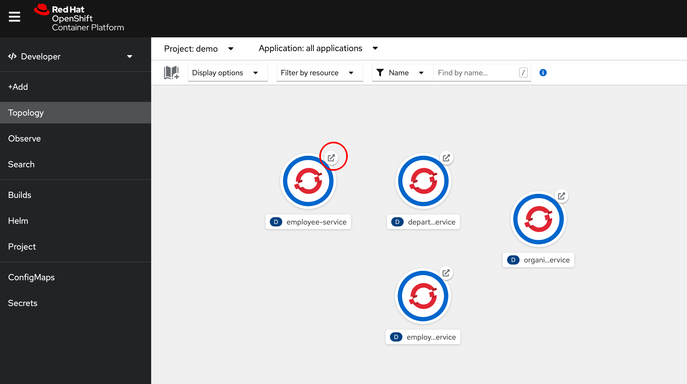

2. Append `/swagger-ui` at the end of URL then press `Enter`. You should be able to see Swagger UI page that shows all REST API endpoints exposed by the service.

   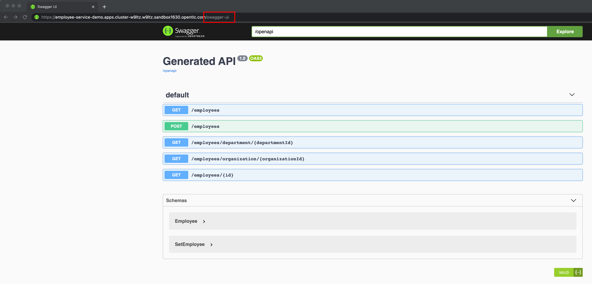

3. Click on the endpoint you need to test, the panel will expand. Then click on **Try it out** button.

   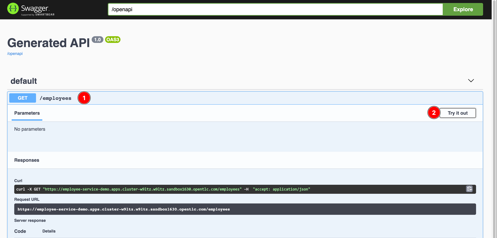

4. Enter paramenter(s) (if necessary), then click **Execute** button. The request URL and response will be shown up like a screenshot below.

   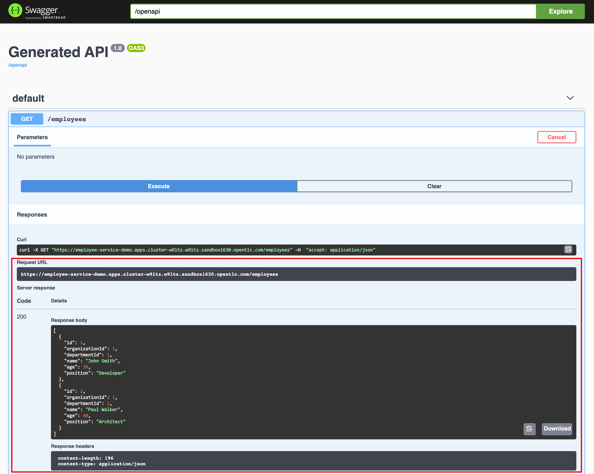

## Testing REST and SOAP APIs with Postman

### Import Postman Collections and Environments

1. Create a new workspace.

   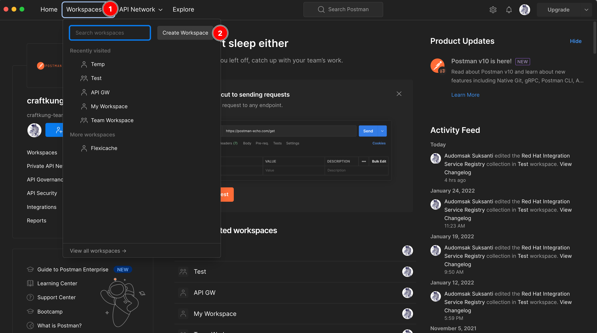

   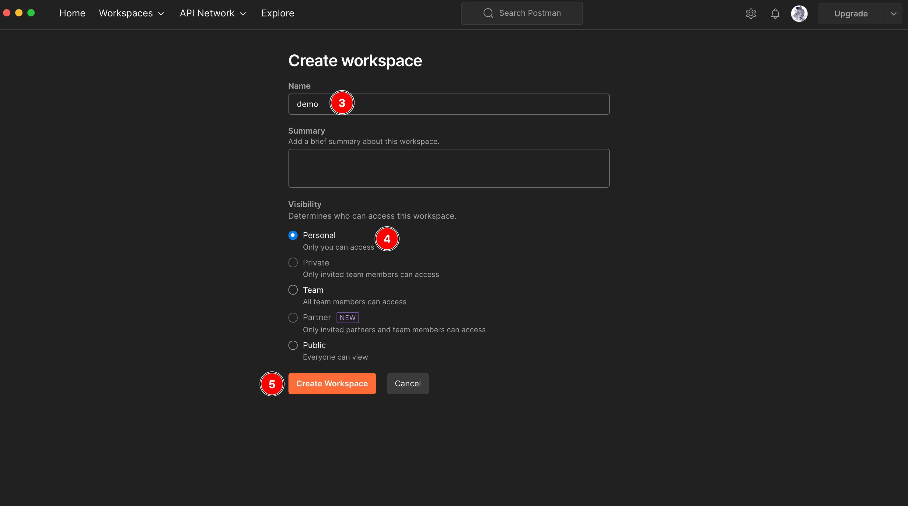

2. Import this [Postman collection](../postman/demo-application-testing.postman_collection.json).

   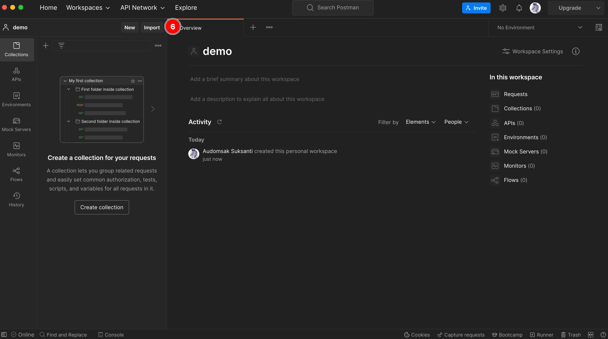

   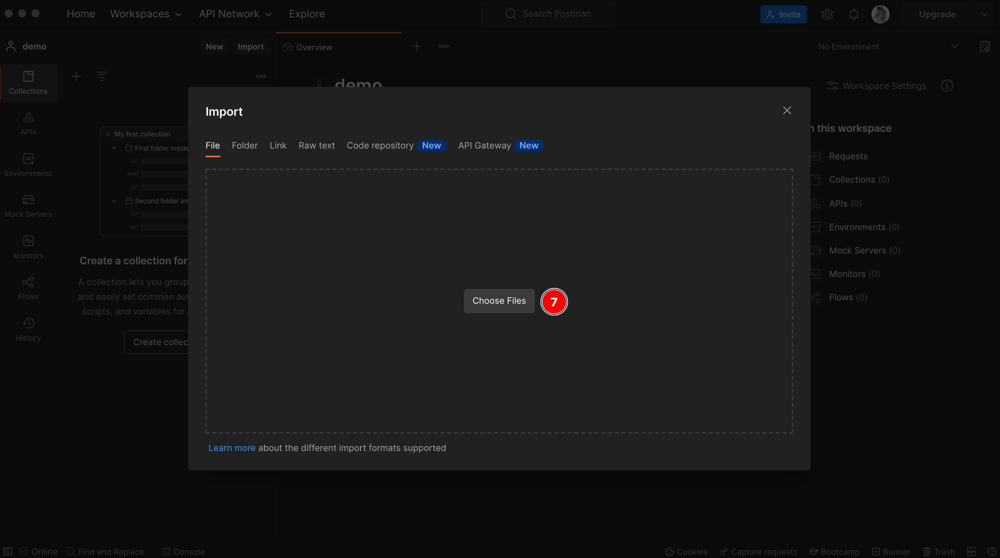

   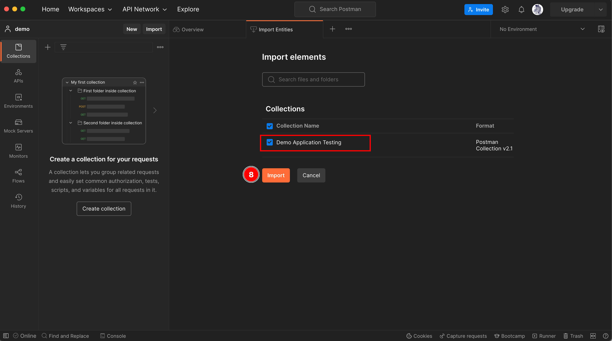

   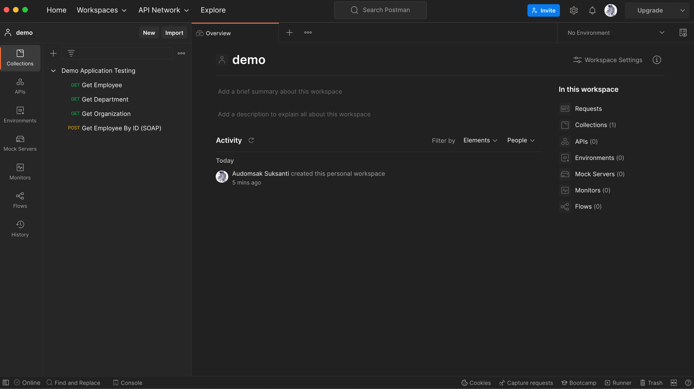

3. Import this [Postman Environments](../postman/default.postman_environment.json).

   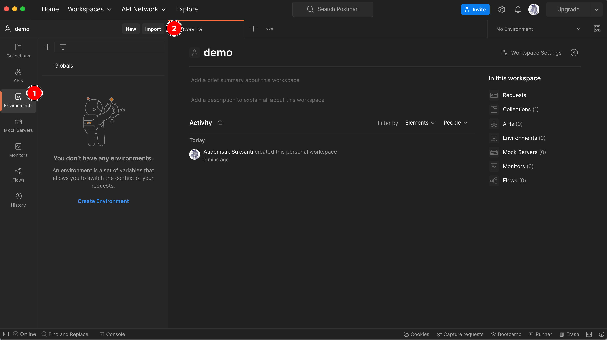

   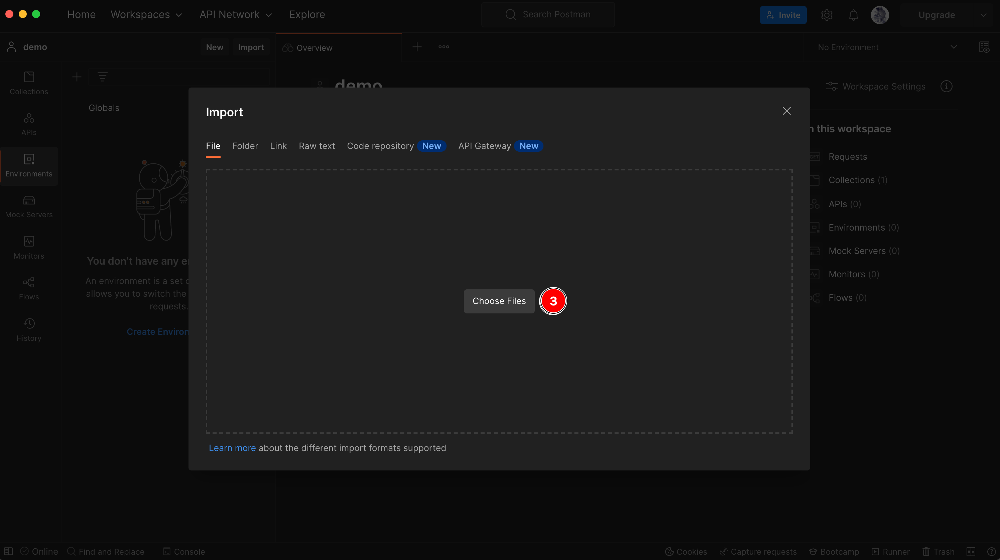

   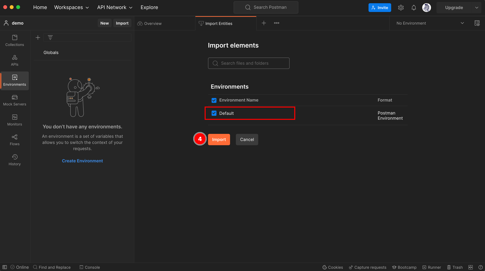

4. Edit Postman `cluster-domain` environment variable by replacing the OpenShift cluster domain.

   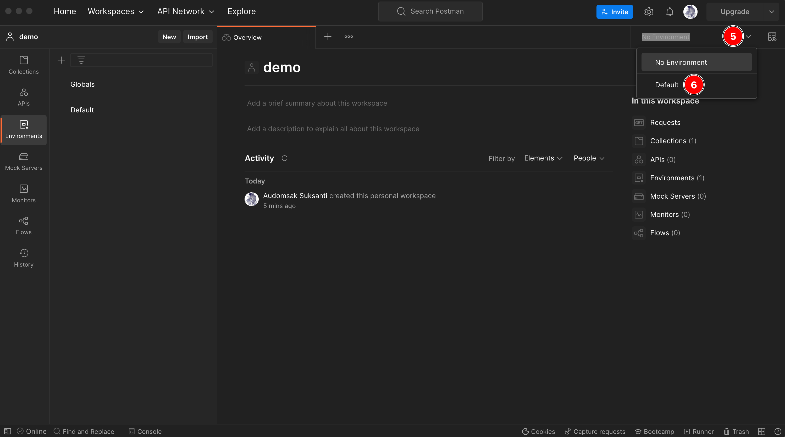

   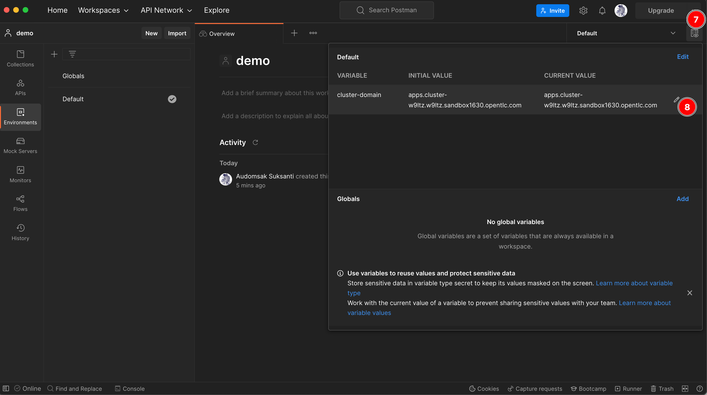

### Testing APIs exposed through services directly

Switch back to **Collection** panel, then open the request you need to test.

   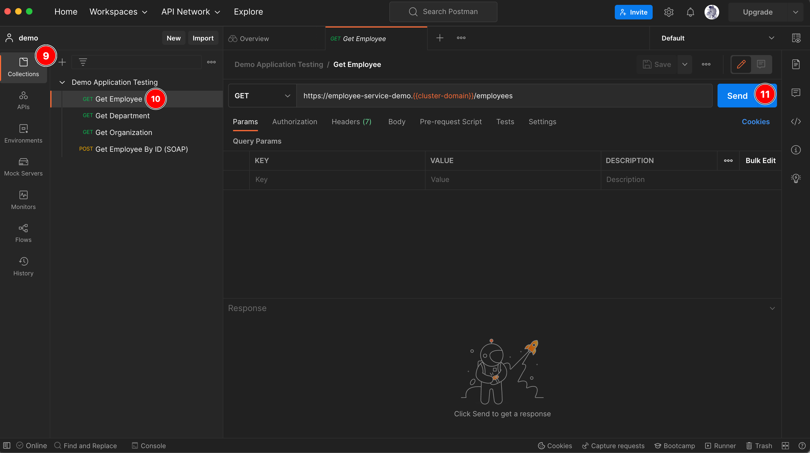

### Testing APIs exposed through API gateway

1. Import this [Postman collection](../postman/3scale-api-testing.postman_collection.json) to the workspace.

2.